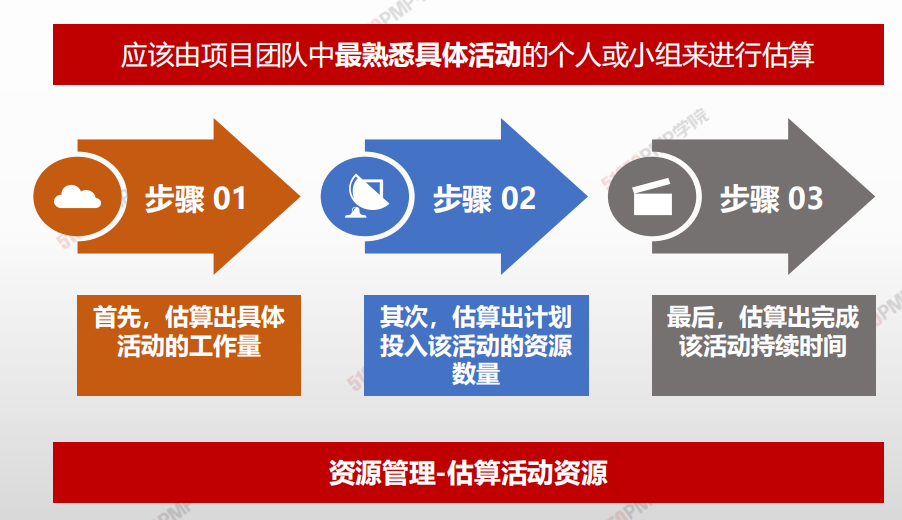
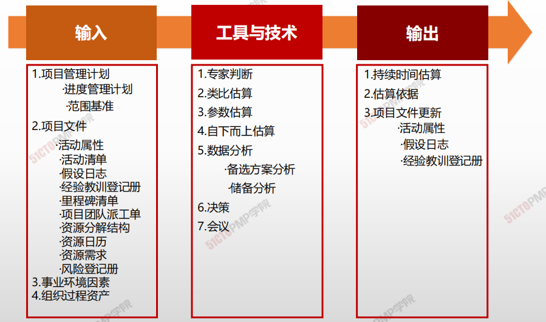
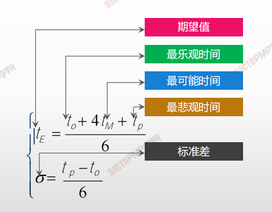
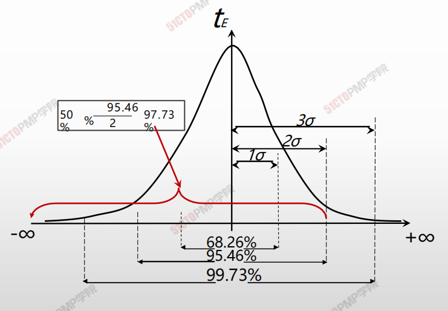

# 估算活动持续时间

> 应该由项目团队中**最熟悉具体活动**的个人或小组来进行估算。

## 4W1H

| 4W1H                | 估算活动持续时间                                             |
| ------------------- | ------------------------------------------------------------ |
| what 做什么     | 根据资源估算的结果，估算完成单项活动所需工作时段数的过程。 <u>作用：确定完成每个活动所需花费的时间量。</u> |
| why 为什么做    | 在工程与设计项目中，随着数据越来越详细，越来越准确，持续时间估算的准确性和质量也会越来越高。 |
| who 谁来做      | 项目管理团队。                                               |
| when 什么时候做 | 活动资源需求记录后。                                         |
| how 如何做      | 估算活动持续时间依据的信息包括：工作范围、所需资源类型与技能水平、估算的资源数量和资源日历，而可能影响持续时间估算的其他因素包括对持续时间受到的约束、相关人力投入、资源类型以及所采用的进度网络分析技术。 <u>专家判断、类比估算、参数估算、自下而上估算、数据分析、决策、会议</u> |

## 输入/工具技术/输出

1. 输入
   1. 项目管理计划
      - 进度管理计划
      - 范围基准
   2. 项目文件
      - 活动属性
      - 活动清单
      - 假设文件
      - 经验教训登记册
      - 里程碑清单
      - 项目团队派工单
      - 资源分解结构
      - 资源日历
      - 资源需求
      - 风险登记册
   3. 事业环境因素
   4. 组织过程资产
2. 工具与技术
   1. 专家判断
   2. 类比估算
   3. 参数估算
   4. 自下而上估算
   5. 数据分析
      - 备选方案分析
      - 储备分析
   6. 决策
   7. 会议
3. 输出
   1. 持续时间估算
   2. 估算依据
   3. 项目文件更新
      - 活动属性
      - 假设日志
      - 经验教训登记册

### 专家判断、类比估算

* 类比法适合评估一些与历史项目在应用领域、环境和复杂度相似的项目，通过新项目与历史项目的比较得到估计数据
* 类比法估计结果的精确度取决于历史项目数据的完整性和准确度
* 项目详细信息不足时，例如在项目的早期阶段，就经常使用这种技术来估算项目持续时间，但准确性也较低

### 参数估算

* 参数估算：将应当完成的工作量乘以生产率时，就可以估算出活动历时的时间。
* 参数估算的准确性取决于参数模型的成熟度和基础数据的可靠性。
* 参数估算可以针对整个项目或项目中的某个部分，并可与其他估算方法联合使用。

### 三点估算

> 历时的三点估算：估计活动的最可能、最乐观以及最悲观时间，通过设置权重，运用统计规律降低历时估算的不确定性

**最可能时间：** 

在为计划活动分派的资源、资源生产效率以及资源的可利用性都充分考虑的前提下，对计划活动估算的持续时间

**最乐观时间：** 

当估算最可能持续时间的依据条件形成最有利的组合时，估算出来的持续时间

**最悲观时间：** 

当估算最可能持续时间的依据条件形成最不利的组合时，估算出来的持续时间

> **适用场景：**
>
> 在PERT中，某些或全部活动持续时间事先不能完全肯定，是利用网络顺序逻辑关系和加权历时来估算项目历时的重要技术。适用于不可预知因素较多的、从未做过的新项目或复杂项目

