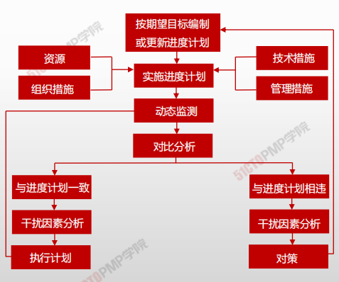
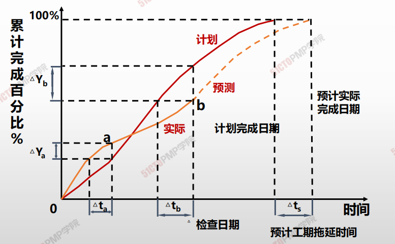
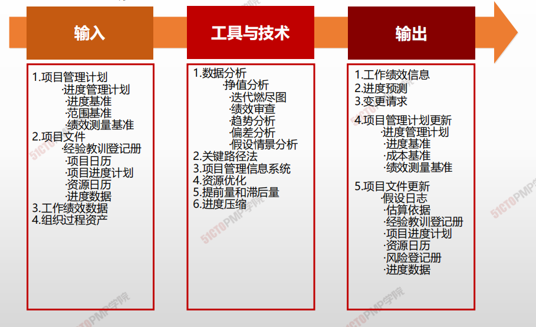
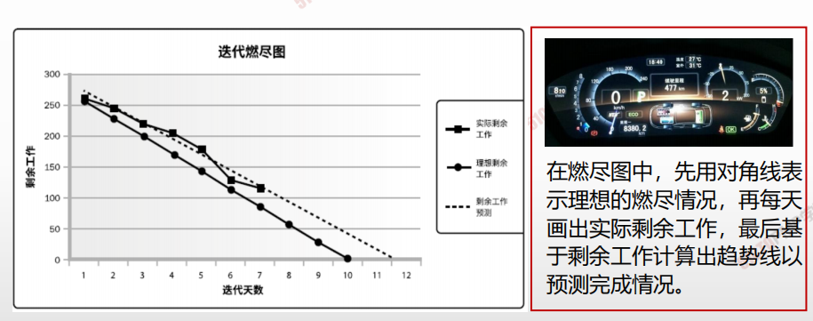
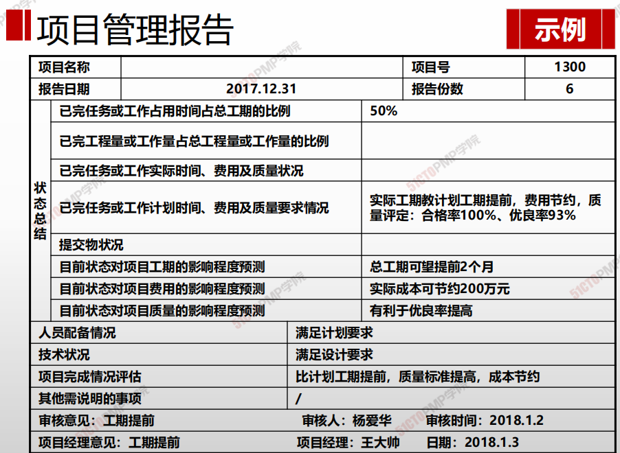

# 估算活动持续时间

> * 项目进度控制是依据项目进度计划对项目的实际进展情况进行控制，使项目能够按时完成
> * 进度控制包括定期收集项目完成情况的数据，将实际完成情况与计划进行比较

**进度控制的主要步骤**

1. 分析进度，找出那些地方需要采取纠正措施。
2. 确定采取哪些具体纠正措施
3. 修改计划，将纠正措施列入计划
4. 重新估算项目进度，评估采取纠正措施的效果

## 4W1H

| 4W1H                | 控制进度                                                     |
| ------------------- | ------------------------------------------------------------ |
| what 做什么     | 监督项目状态，以更新项目进度和管理进度基准变更的过程。 <u>作用：整个项目期间保持对精度基准的维护</u> |
| why 为什么做    | 为实现项目进度目标                                           |
| who 谁来做      | 项目管理团队。                                               |
| when 什么时候做 | 按照计划、基准实时监控，贯穿项目始终                         |
| how 如何做      | 利用项目管理软件和进度计划编制工具，调整时间提前量和后滞量。 <u>数据分析、关键路径法、项目管理信息系统、资源优化、提前量和滞后量、进度压缩</u> |

## 输入/工具技术/输出

### 迭代燃尽图

### 项目管理报告

