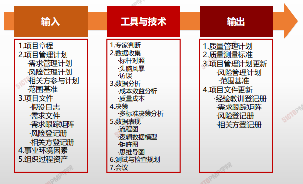
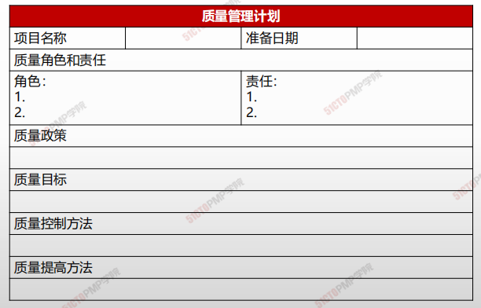

# 规划质量管理

## 4W1H

| 4W1H                | 规划质量管理                                                 |
| ------------------- | ------------------------------------------------------------ |
| what 做什么     | 识别项目及其可交付成果的质量要求和（或）标准，并书面描述项目将如何证明符合质量要求和（或）标准的过程。 作用：为在整个项目期间如何管理和核实质量提供指南和方向 |
| why 为什么做    | 1、识别项目/产品的质量要求和标准； 2、如何达到标准； 3、为项目质量检验、项目/产品质量验收制定标准。 |
| who 谁来做      | 项目团队可能举行规划会议来制定成本管理计划。参会者可能包括项目经理、项目发起人、选定的项目团队成员、选定的相关方、项目成本负责人，以及其他必要人员。 |
| when 什么时候做 | 应该在项目规划阶段的早期就对成本管理工作进行规划，建立各成本管理过程的基本框架。 |
| how 如何做      | 通过规划输入输出，来确认项目成本管理的需求。 <u>专家判断、数据分析、会议</u> |

## 输入/工具技术/输出

1. 输入

   1. 项目章程
   2. 项目管理计划
      - 需求管理计划
      - 风险管理计划
      - 相关方参与与计划
      - 范围基准
   3. 项目文件
      - 假设日志
      - 需求文件
      - 需求跟踪矩阵
      - 风险登记册
      - 相关方登记册
   4. 事业环境因素
   5. 组织过程资产

2. 工具与技术

   1. 专家判断
   2. 数据收集
      - 标杆对照
      - 头脑风暴
      - 访谈
   3. 数据分析
      - 成本效益分析
      - 质量成本
   4. 决策
      - 多标准决策分析
   5. 数据表现
      - 流程图
      - 逻辑数据模型
      - 矩阵图
      - 思维导图
   6. 测试与检查规划
   7. 会议

3. 输出

   1. 质量管理计划
   2. 质量测量标准
   3. 项目管理计划更新
      - 风险管理计划
      - 范围基准
   4. 项目文件更新
      - 经验教训登记手册
      - 需求跟踪矩阵
      - 风险登记册
      - 相关方登记册

   

## 质量管理计划

质量管理计划包括（但不限于）一下组成部分：

* 项目采用的质量标准
* 项目的质量目标
* 质量角色与职责
* 需要质量审查的项目可交付成果和过程
* 为项目规划的质量控制和质量管理活动
* 项目使用的质量工具
* 有项目有关的主要程序

## 质量测量指标

用于**描述项目或产品属性，**以及控制质量过程将如何验证符合程度。

- 质量测量指标的例子包括
  - CPI
  - 缺陷率
  - 故障率
  - 每个代码行的错误
  - 客户满意度分数
  - 测试覆盖率

1. 质量是规划、设计和建造出来的，而不是检查出来的

2. 质量规划的输入、输出和工具与技术

3. 当质量的成本投入与收益回报正好相等时，质量达到最佳

4. 质量成本分为一致性成本和非一致性成本