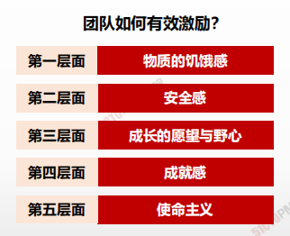
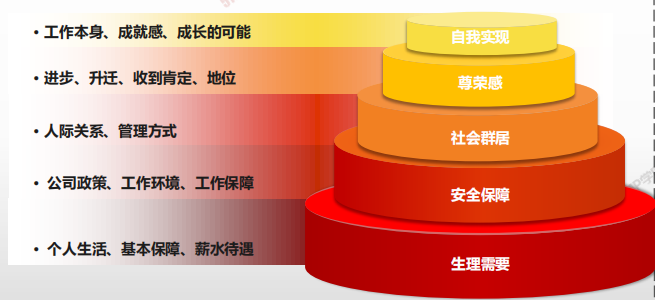
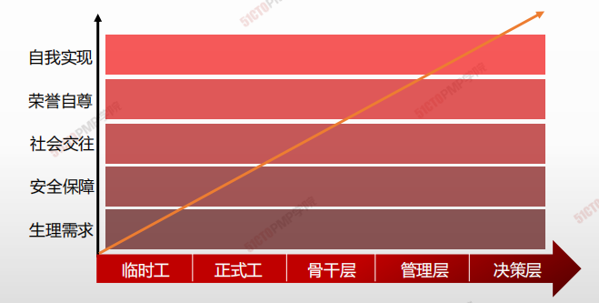
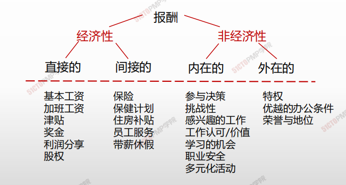
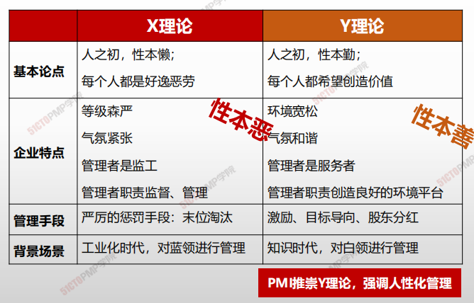

# **华为的成功之道**

> 欲望的激发和控制，构成了一部华为的发展史，构成了人类任何组织的管理史。一家企业管理的成与败、好与坏，背后所展示的逻辑，都是人性的逻辑、欲望的逻辑。
>
> ​																																		——任正非

## 马斯洛需求层次理论

## 马斯洛需求层次理论

## 赫茨伯格双因素理论

| **卫生因素（外在因素）** | **激励因素（内在因素）** |
| ------------------------ | ------------------------ |
|        • 与上级主管之间的人事关系                   |                    • 工作上的成就感      |
|• 与同级之间的人事关系 |• 工作中得到认可和赞赏|
|• 与下级之间的人事关系|• 工作本身的挑战性和兴趣|
|• 工作环境或条件 |• 工作职务上的责任感|
|• 薪金 |• 工作的发展前途|
|• 个人的生活 |• 个人成长、晋升的机会|
|• 职务、地位||

## 赫茨伯格双因素理论

## 麦克格雷-X、Y理论

## 激励理论核心观点

| 提出人                                       | 理论名称         | 核心观点                                                     |
| -------------------------------------------- | ---------------- | ------------------------------------------------------------ |
| **马斯洛**                                   | **需求层次理论** | 人的需求分为从低到高五个层次，生理、安全、社会需求、尊重和自我实现，激励来自没有满足的需求。 |
| **赫茨伯格**                                 | **激励理论**     | 1、把劳动者的需求分为两类可激励因素，保健因素（外在）和激励因素（内在）。 2、保健因素良好不会使员工得到激励，但恶劣的的保健因素会损害员工的积极性。 3、激励因素存在会使员工得到激励，没有激励，员工不会努力工作。 |
| **麦克格利格**                               | **X理论**        | X理论对人的看法是悲观的、消极的 ,应该进行严格的管理、指挥、监视和控制 ，监管导向。 |
|                                              | **Y理论**        | Y理论对人的看法是乐观的、积极的，人们愿意工作并有所成就感,能自我激励,渴望承担责任，激励导向。 |
| **北美著名心理学家和行为科学家维克·-弗鲁姆** | **期望理论**     | 人们相信努力能产生成功的结果，并取得相应的报酬。人们在工作中的积极性或努力程度（激发）力量M是效价V和期望值E的乘积M=V×E  (1)工作能提供给他们真正需要的东西； (2）他们欲求的东西是和绩效联系在一起的； (3）只要努力工作就能提高他们的绩效。 |
| **日裔美国学者W.大内**                       | **Z理论**        | 任何企业组织都应该对他们的内部的社会结构进行变革，使之既能满足新的竞争住需要，又能满足各个雇员自我利益的需要 |
| **戴维·麦克利兰**                            | **成就动机理论** | 以三个因素反映需要与目标之间的关系的：权利需要、亲和需要、成就需要。管理者应该根据各人更重视的需要来制定激励措施： • 为成就需要者设立具有挑战性但可实现的目标 • 为权力需要者提供较能体现地位的工作环境 • 为亲和需要者提供合作而非竞争的工作环境 |

**1.华为的成功之道**

**2.马斯洛需求层次理论**

**3.赫茨伯格双因素理论**

**4.麦克格雷-X、Y理论**

**5.激励理论核心观点**