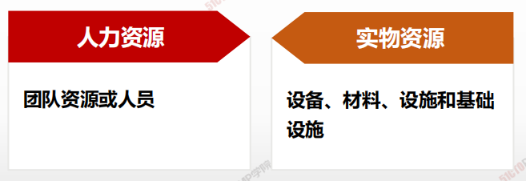
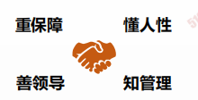

# 项目资源管理概述

> 包括识别、获取和管理所需资源以成功完成项目的各个过程，这些过程有助于确保项目经理和团队在正确的时间和地点使用正确的资源。

| 9.1  | 规划资源管理 | 定义如何估算、获取、管理和利用实物以及团队项目资源的过程。   |
| ---- | ------------ | ------------------------------------------------------------ |
| 9.2  | 估算活动资源 | 估算执行项目所需的团队资源，以及材料、设备和用品的类型和数量的过程。 |
| 9.3  | 获取资源     | 获取项目所需的团队成员、设施、设备、材料、用品和其他资源的过程。 |
| 9.4  | 建设团队     | 提高工作能力，促进团队成员互助，改善团队整体氛围，以提高项目绩效的过程。 |
| 9.5  | 管理团队     | 跟踪团队成员工作表现，提供反馈，解决问题并管理团队变更，以优化项目绩效的过程。 |
| 9.6  | 控制资源     | 确保按计划为项目分配实物资源，以及根据资源的使用计划监督资源实际使用情况，并采取必要纠正措施的过程。 |

1. <u>**定（定角色、定资源规划）**</u>
2. **<u>估（活动资源）</u>**
3. **<u>筹（获取资源）</u>**
4. **<u>建（团队建设使其成长）</u>**
5. **<u>管（绩效用人、绩效考核、有效激励</u>**
6. **<u>控（资源调整和控制）</u>**

