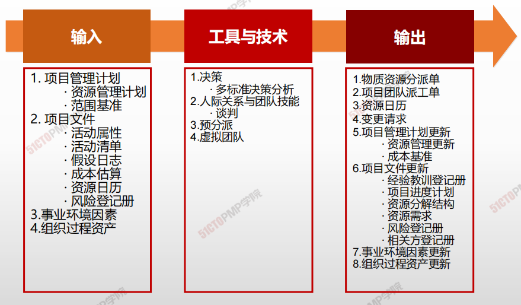

# 获取资源

## 4W1H

| 4W1H                | 获取资源                                                     |
| ------------------- | ------------------------------------------------------------ |
| what 做什么     | 获取项目所需的团队成员、设施、设备、材料、用品和其他资源的过程。 作用：概述和指导资源的选择，并将其分配给相应的活动。 |
| why 为什么做    | 为开展项目工作配备资源，组成团队。                           |
| who 谁来做      | 项目所需资源可能来自项目执行组织的内部或外部。内部资源由职能经理或资源经理负责获取（分配），外部资源则是通过采购过程获得 |
| when 什么时候做 | 项目早期，从项目经理确定开始，项目团队逐渐组建               |
| how 如何做      | 多种方式引入资源。 决策、人际关系与团队技能、预分派、虚拟团队 |

## 输入/工具技术/输出

1. 输入

   1. 项目管理计划
      - 资源管理计划
      - 范围基准
   2. 项目文件
      - 活动属性
      - 活动清单
      - 假设文件
      - 成本估算
      - 资源日历
      - 风险登记册
   3. 事业环境因素
   4. 组织过程资产

2. 工具与技术

   1. 决策
      - 多标准决策分析
   2. 人际关系与团队技能
      - 谈判
   3. 预分派
   4. 虚拟团队

3. 输出

   1. 物质资源分派单
   2. 项目团队派工单
   3. 资源日历
   4. 变更请求
   5. 项目管理计划更新
      - 资源管理更新
      - 成本基准
   6. 项目文件更新
      - 经验教训登记册
      - 项目进度计划
      - 资源分解结构
      - 资源需求
      - 风险等级册
      - 相关方登记册
   7. 事业环境因素更新
   8. 资质过程资产更新

   

## 虚拟团队

> 存在共同目标、单在完成角色任务的过程中很少或没时间面对面工作的一群人。沟通管理更为重要

- **提高组建团队的灵活性**

- **开展本不能开展的项目**
- **需要特别好的沟通计划**
- **需要真正的团队建设**

## 资源日历

