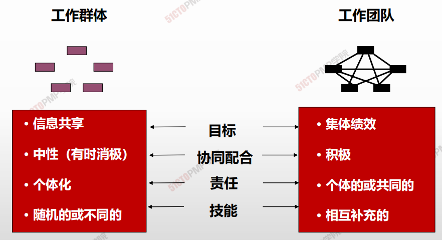
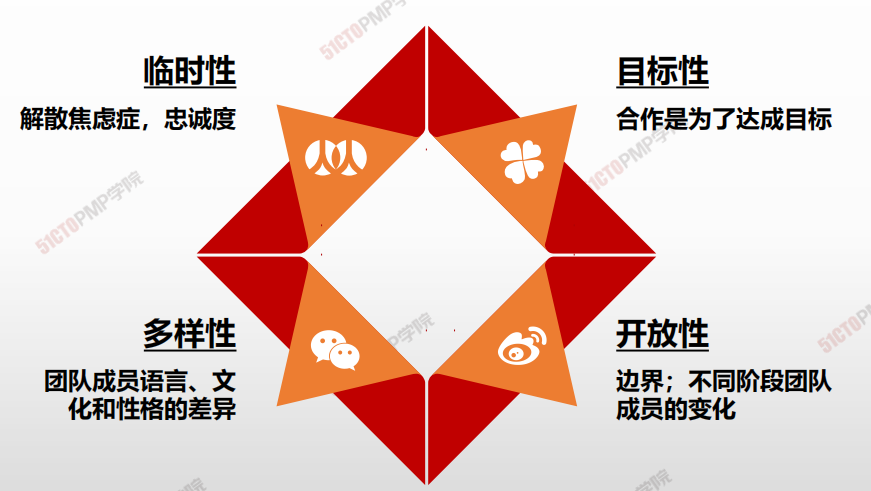
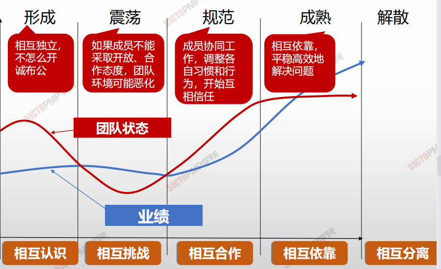
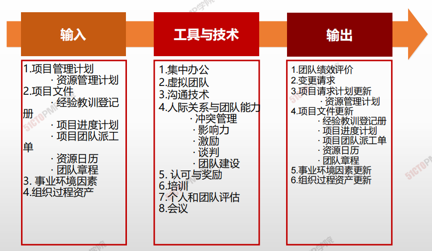

# 团队建设

## 4W1H

| 4W1H                | 团队建设                                                     |
| ------------------- | ------------------------------------------------------------ |
| what 做什么     | 是提高工作能力，促进团队成员互动，改善团队整体氛围，以提高项目绩效的过程。 <u>作用</u>：改进团队协作、增强人际关系技能、激励员工、减少摩擦以及提升整体项目绩效。 |
| why 为什么做    | 项目经理应该能够定义、建立、维护、激励、领导和鼓舞项目团队，使团队高效运行，并实现项目目标。 |
| who 谁来做      | 项目经理。                                                   |
| when 什么时候做 | 伴随项目团队组建，建设项目团队工作开始。                     |
| how 如何做      | 项目管理团队应该利用文化差异，在整个项目生命周期中致力于发展和维护项目团队，并促进在相互信任的氛围中充分协作；通过建设项目团队，可以改进人际技巧、技术能力、团队环境及项 目绩效。 <u>集中办公、虚拟团队、沟通技术、人际关系与团队技能、认可与奖励、培训、个人和团队评估、会议</u> |

## 团队的定义和特点

## 成功的项目团队的特点

- 团队目标明确，成员清楚自己工作对目标的贡献；
- 团队的组织结构清晰，岗位明确；
- 有成文的工作流程和方法、流程简介有效；
- 项目经理对团队成员有明确的考核和评价标准，评价结果
- 工头制定并遵守组织纪律；
- 协同工作，知识共享。

**PMI**<u>团队理念</u>

- 团队和个人的共同发展
- 不能简单牺牲团队成员的利益来完成项目
- 成员尽早参与项目计划和决策的积极作用
- 角色定位，人尽其才
- 项目经理软技巧重要性，正向的管理和领导
- 积极、主动面对项目中出现的问题

## Bruce Tuckmans 模型

## 团队不同阶段领导风格

| 阶段                     | 成员情绪                    | 典型疑问、行为                                               | PM重点                  | PM风格                                 |
| ------------------------ | --------------------------- | ------------------------------------------------------------ | ----------------------- | -------------------------------------- |
| 形成阶段 Forming     | 兴奋、期望、 焦虑、怀疑 | 我的目的是什么？ 我的角色和任务是什么？ 我能和别人合得来吗？ | 指导、分析              | 指导型 Directive style             |
| 震荡阶段 Storming    | 挫折、愤怒、 紧张、对立 | 我的职责是什么？ 我该如何配合别人？ 我知道他的缺点，可不 知道如何帮他？ | 冲突管理、运 用影响 | 影响型 Selling or  Influence style |
| 规范阶段 Normalizing | 明确、信任、 规范、交流 | 关系确立 接受团队规则 逐步有凝聚力                   | 帮助建立关系            | 参与型 Participative  style        |
| 成熟阶段 Performing  | 开放、沟通、 积极、激情 | 具有集体感、荣誉感 积极开放 配合默契                 | 授权                    | 授权型 Delegate style              |

## 输入/工具技术/输出

1. 输入

   1. 项目管理计划
      - 资源管理计划
   2. 项目文件
      - 经验教训登记册
      - 项目进度计划
      - 项目团队派工单
      - 资源日历
      - 团队章程
   3. 事业环境因素
   4. 组织过程资产

2. 工具与技术

   1. 集中办公
   2. 虚拟团队
   3. 沟通技术
   4. 人际关系与团队能力
      - 冲突管理
      - 影响力
      - 激励
      - 谈判
      - 团队建设
   5. 认可与奖励
   6. 培训
   7. 个人和团队评估
   8. 会议

3. 输出

   1. 团队绩效评价
   2. 变更请求
   3. 项目请求计划更新
      - 资源管理计划
   4. 项目文件更新
      - 经验教训登记册
      - 项目进度计划
      - 项目团队派工单
      - 资源日历
      - 团队章程
   5. 事业环境因素更新
   6. 组织过程资产更新

   

## 集中办公

- 把**许多或全部最活跃的成员**安排在同一地点办公
- 集中办公可以是临时的或贯穿整个项目
- 借助团队会议室-**作战室**开展集中办公，也称为**紧密矩阵**

## 团队绩效评价

>  以任务和结果为导向，项目结果完成符合要求，这是高效团队的特征

评价团队有效性的指标可包括：

个人技能的改进，从而使成员更有效地完成工作任务；

团队能力的改进，从而使团队成员更好地开展工作；

团队成员离职率的降低；

团队凝聚力的加强，从而使团队成员开放地分享信息和经验，并互相帮助，

来提高项目绩效

1. 建设团队是提高工作能力，促进团队成员互动，
改善团队整体氛围，以提高项目绩效的过程团
队协作是项目成功的关键因素，而建设高效的
项目团队是项目经理的主要职责之一
2. 塔克曼阶梯理论认为：团队发展通常要经过形
成、震荡、规范、成熟、 解散五个阶段
3. 不论是集中办公还是虚拟团队，沟通都至关重
要
4. 项目管理团队应该对项目团队的有效性进行正
式或非正式的评价