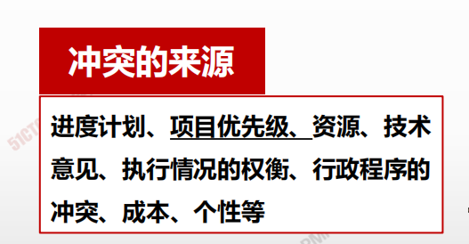
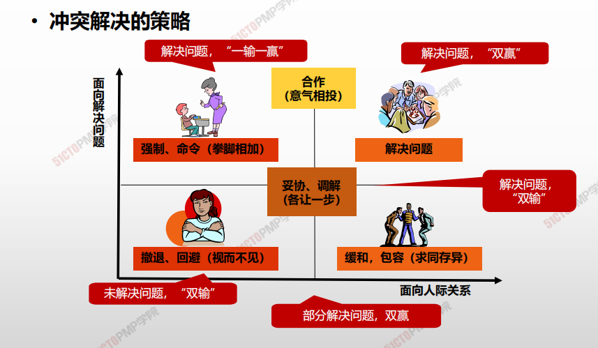
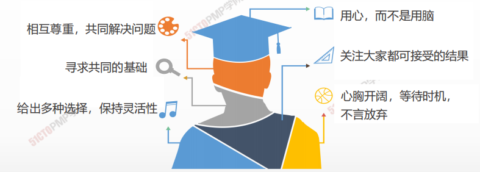

# 管理团队

## 4W1H

| 4W1H                | 获取资源                                                     |
| ------------------- | ------------------------------------------------------------ |
| what 做什么     | 跟踪团队成员工作表现，提供反馈，解决问题并管理团队变更，以优化项目绩效的过程。 作用：影响团队行为、管理冲突以及解决问题。 |
| why 为什么做    | 影响团队行为、管理团队冲突，解决各种问题，关注团队成员个人技能，保证项目绩效，从而保证项目目标的实现。 |
| who 谁来做      | 项目经理。                                                   |
| when 什么时候做 | 贯穿项目生命周期始终                                         |
| how 如何做      | 需要综合运用各种技能，特别是沟通、冲突管理、谈判和领导技能。项目经理应该向团队成员分配富有挑战性的任务，并对优秀绩效进行表彰。 <u>人际关系与团队技能、项目管理信息系统</u> |

## 输入/工具技术/输出

1. 输入

   1. 项目管理计划
      - 资源管理计划
   2. 项目文件
      - 问题日志
      - 经验教训登记册
      - 项目团队派工单
      - 团队章程
   3. 工作绩效评价
   4. 团队绩效评价
   5. 事业环境因素
   6. 组织过程资产

2. 工具与技术

   1. 集中办公
      - 冲突管理
      - 制定决策
      - 情商
      - 影响力
      - 领导力
   2. 项目管理信息系统

3. 输出

   2. 变更请求
   3. 项目请求计划更新
      - 资源管理计划
      - 进度基准
      - 成本基准
   4. 项目文件更新
      - 经验教训登记册
      - 问题日志
      - 项目团队派工单
   5. 事业环境因素更新

   

## 冲突管理

| 来                       | 源                                                           |
| ------------------------ | ------------------------------------------------------------ |
| 进度计划                 | 项目任务的进度安排、任务的排序和事件选择存在不同意见         |
| 项目优先级               | 相关方在任务的优先级顺序上有不同的意见（项目前期）           |
| 资源稀缺                 | 资源匮乏（项目前期）                                         |
| 技术意见与执行情况的权衡 | 在技术问题与执行情况权衡上，存在不一致意见                   |
| 行政程序上的冲突         | 在如何管理项目的问题上，发生的项目管理和行政管理程序之间的冲突 |
| 成本                     | 在涉及到工作分解结构上，来支持部门的成本估算上的冲突         |
| 个人工作风格、个性       | 人际关系方面的冲突（项目中期）                               |

| 传统的冲突观念         | 现代冲突的观念             |
| ---------------------- | -------------------------- |
| 冲突时麻烦制造者引起的 | 冲突是人和人之间不可避免的 |
| 是坏事                 | 经常是有益的               |
| 应避免                 | 是变化带来的自然结果       |
| 必须被压制             | 是能够并且应被管理的事情   |

> 假如意见分歧成为负面因素，应该首先由项目团队成员负责解决：
>
> - 如果冲突升级，项目经理应提供协助，促成满意的解决方案，采用
>
> 直接和合作的方式，尽早并且通常在私下处理冲突。
>
> - 如果破坏性冲突继续存在，则可使用正式程序，包括采取惩戒措施

> **八字方针：”直接“、”合作“、”尽早“、”私下“管理冲突。**

## 冲突管理策略

| 解决方式 | 特点 | 说明 | 其他 |
| -------- | ---- | ---- | ---- |
|   解决问题/合作       | 赢-赢    |  综合考虑不同的观点和意见，采用合作的态度和开放式对话引导各方达成共识和承诺，这种方法可以带来双赢局面。    | **最好的冲突解决方式**     |
| 面对         |  赢-赢    |   双方把问题摆到桌面上谈开，通过协商，共同决定选择某个方案，放弃另一个方案。   |      |
|  妥协/调解        |  各让一步、不输不赢    |   为了暂时或部分解决冲突，寻找能让各方都在一定程度上满意的方案，但这种方法有时会导致“双输”局面。   |   冲突各方都有一定程度满意、但冲突各方没有任何一方完全满意   |
| 缓和/包容         |  求同存异    |  强调一致而非差异；为维持和谐与关系而退让一步，考虑其他方的需要。    | 保持一种友好的气氛，但是回避了解决冲突的根源。     |
| 撤退/回避         | 双输，矛盾被搁置“离他远点”     |  从实际或潜在冲突中退出，将问题推迟到准备充分的时候，或者将问题推给其他人员解决。    |  短期可以，长远来看不好。降温或解决问题条件不成熟。    |
| 强制/命令         |  赢-输  单赢-“我就要赢！”    |  以牺牲其他方为代价，推行某一方的观点；只提供赢 — 输方案。    |  通常是利用权力来强行解决紧急问题，会破坏团队气氛。    |

> - 把问题摆到桌子上；对事不对人；
> - 以最有利于团队和项目的方式解决冲突；
> - 寻找有利于现在和未来的解决方法；
> - 冲突最好由当事人自己尽早解决，直接上级可以协助，必要时PM采取强制措施；
> - 违反职业道德引发的冲突，不能靠当事人自己解决。

## 建设团队vs.管理团队

- 建设团队：是基于什么行为能导致良好团队绩效的**预测**，采取这些行为“**推动**”团队发展。
- 管理团队：是基于对实际行为及其效果的**回顾**，采取补充行为“**拉动**”团队发展。更像一个监控过程。

---

1. 管理团队是跟踪团队成员工作表现，提供反馈，
解决问題并管理团队变更，以优化项目绩效的过
程
2. 在项目环境中，冲突不可避免，适当的冲突是有
益的
3. 冲突的解决方案是：撤退/回避、缓和/包容、妥
协/调解、强迫/命令、合作/解决问題
4. 情商是指了解、评价和管理自我情绪、他人情绪
及团体情绪的能力

