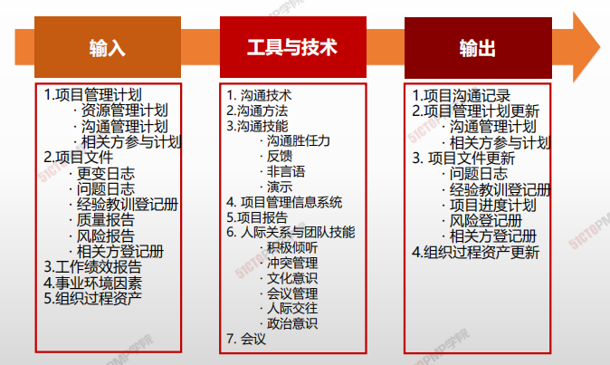
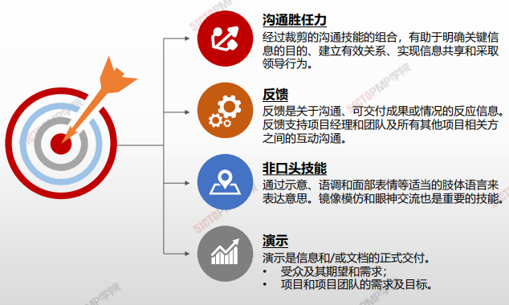
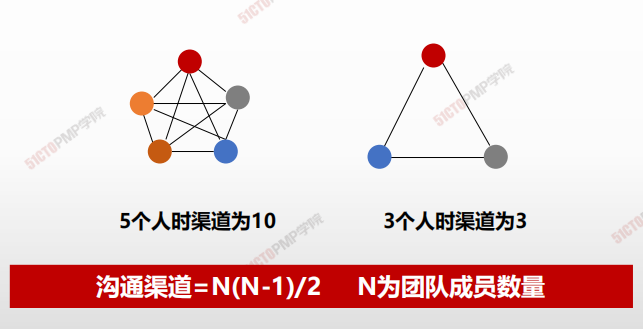

# 管理沟通

## 4W1H

| 4W1H                | 管理沟通                                                     |
| ------------------- | ------------------------------------------------------------ |
| what 做什么     | 确保项目信息及时且恰当地收集、生成、发布、存储、检索、管理、监督和最终处置的过程。 作用：促成项目团队与相关方之间的有效信息流动 |
| why 为什么做    | 本过程不局限于发布相关信息，它还设法确保信息以适当的格式正确生成和送达目标受众。本过程也为相关方提供机会，允许他们请求更多信息、澄清和讨论。 实现有效率、有效果沟通 |
| who 谁来做      | 项目管理团队。                                               |
| when 什么时候做 | 本过程需要在整个项目期间开展。                               |
| how 如何做      | 管理沟通过程会涉及与开展有效沟通有关的所有方面，包括使用适当的技术、方法和技巧。此外，它还应允许沟通活动具有灵活性，允许对方法和技术进行调整，以满足相关方及项目不断变化的需求。 <u>沟通技术、沟通方法、沟通技能、项目管理信息系统、项目报告、人际关系与团队技能、会</u>议 |

## 输入/工具技术/输出

1. 输入

   1. 项目管理计划
      - 资源管理计划
      - 沟通管理计划
      - 相关方管理计划
   2. 项目文件
      - 变更日志
      - 问题日志
      - 经验教训登记册
      - 质量报告
      - 风险报告
      - 相关方登记册
   3. 工作绩效报告
   4. 事业环境因素
   5. 组织过程资产
2. 工具与技术
   1. 沟通技术
   2. 沟通方法
   3. 沟通技能
      - 沟通胜任力
      - 反馈
      - 非言语
      - 演示
   4. 项目管理信息系统
   5. 项目报告
   6. 人际关系与团队技能
      - 积极倾听
      - 冲突管理
      - 文化意识
      - 会议管理
      - 人际交往
      - 政治意识
   7. 会议
3. 输出
   1. 项目沟通记录
   2. 项目管理计划更新
      - 沟通管理计划
      - 相关方参与计划
   3. 项目文件更新
      - 问题日志
      - 经验教训登记册
      - 项目进度计划
      - 风险登记册
      - 相关方登记册
   4. 组织过程资产更新

## 沟通技能

## 沟通渠道计算

---

1. 管理沟通是确保项目信息及时且怡当地收集、生
  成、发布、 存储、检索、管理、监督和最终处置
  的过程
2. 项目信息应发布给众多相关方群体，应针对每种
  相关方来调整项目信息发布的适当层次、形式和
  细节