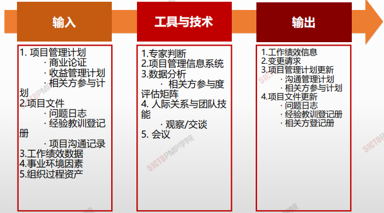
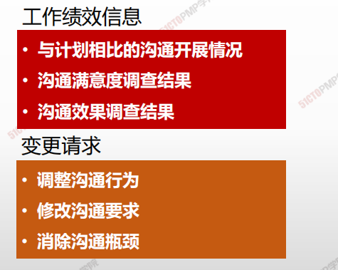
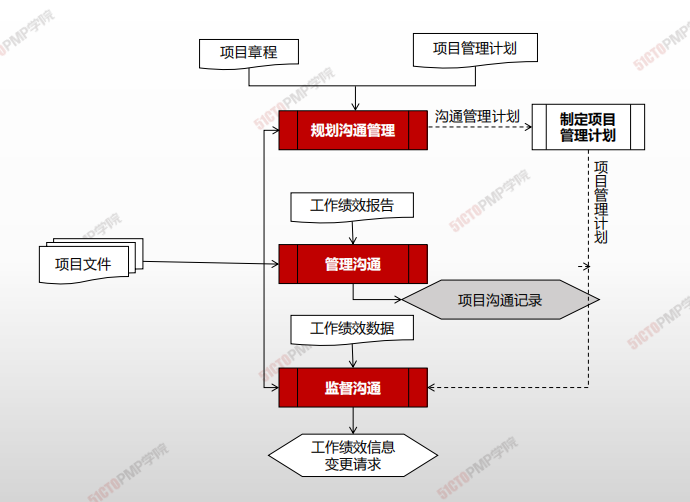

# 监督沟通

## 4W1H

| 4W1H                | 管理沟通                                                     |
| ------------------- | ------------------------------------------------------------ |
| what 做什么     | 确保满足项目及其相关方的信息需求的过程。 作用：按沟通管理计划和相关方参与计划的要求优化信息传递流程。 |
| why 为什么做    | 通过监督沟通过程，来确定规划的沟通工作和沟通活动是否如预期提高或保持了相关方对项目可交付成果与预计结果的支持力度。项目沟通的影响和结果应该接受认真的评估和监督，以确保在正确的时间，通过正确的渠道，将正确的内容（<u>发送方和接收方对其理解一致</u>）传递给正确的受众。 |
| who 谁来做      | 项目经理与项目管理团队                                       |
| when 什么时候做 | 本过程需要在整个项目期间开展                                 |
| how 如何做      | 监督沟通可能需要采取各种方法，例如，开展客户满意度调查、整理经验教训、开展团队观察、审查问题日志中的数据，或评估相关方参与度评估矩阵中的变更。 <u>专家判断、项目管理信息系统、数据分析、人际关系与团队技能、会议</u> |

## 输入/工具技术/输出

1. 输入

   1. 项目管理计划
      - 商业论证
      - 收益管理计划
      - 相关方参与计划
   2. 项目文件
      - 问题日志
      - 经验教训等级册
      - 项目沟通记录
   3. 工作绩效数据
   4. 事业环境因素
   5. 组织过程资产
2. 工具与技术
   1. 专家判断
   2. 项目挂历信息系统
   3. 数据分析
      - 相关方参与度评估矩阵
   4. 人际关系与团队技能
      - 观察/交谈
   5. 会议
3. 输出
   1. 工作绩效信息
   2. 变更请求
   3. 项目管理计划更新
      - 沟通管理计划
      - 相关方参与计划
   4. 项目文件更新
      - 问题日志
      - 经验教训登记册
      - 相关方登记册

## 工作绩效信息和变更请求

---

1. 监督沟通是确保满足项目及其相关方的信息需求
  的过程
2. 监督沟通过程可能触发规划沟通管理和管理沟通
  过程的迭代，以便修改沟通计划并开展额外的沟
  通活动
3. 监督沟通要确保在正确的时间，通过正确的渠道，
  将正确的内容传递给正确的受众

