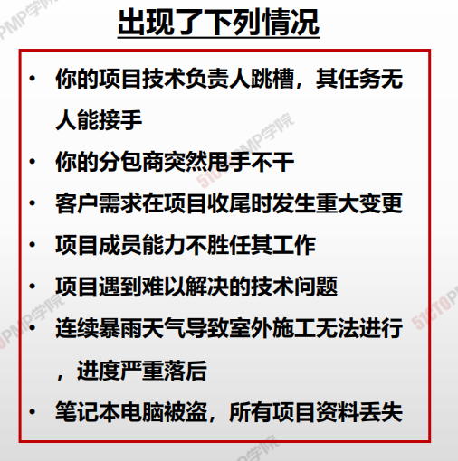
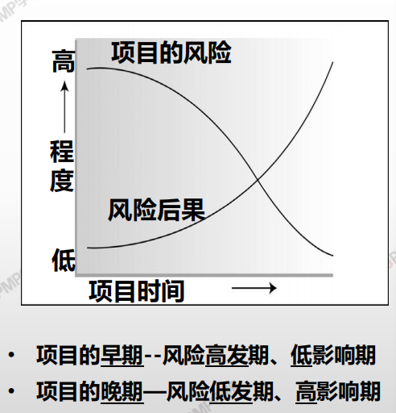
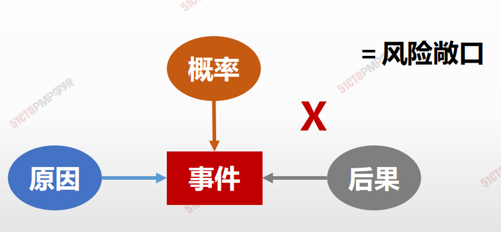
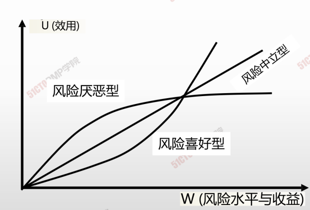

# 项目风险概述

## 项目风险认知

* 项目是独特的，必然存在风险，任何一个项目的挂历都必须面对风险。
* 风险管理决定项目的成败，它是最容易出问题的地方，项目最薄弱的地方。
* 风险不等于 ” 坏事 “ ；
* 大多是风险都是可以预测和管理的，甚至90%的风险都是可预测的；

## 项目风险的特点

- 项目风险贯穿整个项目生命周期，并且项目的不同阶段会有不同的风险。
- 风险随着项目的进展而变化，其不确定性一般会逐渐减少。
- 最大的不确定性存在于项目的早期，早期阶段做出的决策对以后阶段和项目目标的实现影响最大。

## 项目风险管理的特点

* 项目风险管理是为了减轻潜在的不利事件对项目的影响而采取的一项活动。
* 风险管理是一种投资，需要成本。
* 在任何情况下，项目风险管理的成本不应超过项目潜在的收益。
* 需要努力在项目的各个方面寻找风险和机会之间的平衡；

---

- 风险从 <u>项目构思</u>那一刻就存在，贯穿整个项目生命周期。
- 树立风险意识，<u>积极主动</u>管理风险，而不是消极被动应对风险。
- 风险并不可怕，可怕的是对风险存在 <u>**侥幸心里**</u>，<u>**最大的风险是不认真对待风险**</u>

---

## 风险四要素

## 风险管理概述

* 不同的人对风险的 <u>取向不同</u>
* 相同的财富金额，在不同的人心里有不同的效用
* 获得的心理满足效用不同

## 风险分类

### 已知风险

### 未知风险

#### <u>已知已知的风险</u>可能造成损失：<u>应对措施 - 直接成本</u>

#### <u>已知未知的风险</u>可能造成损失：<u>应急计划 - 应急储备</u>

#### <u>未知未知的风险</u>可能造成损失：<u>权变措施 - 管理储备</u>

> 对于已知未知，必须加以管理，以便降低威胁。对于未知未知风险，则只能听之任之，待实际发生后再来处理。如果去管理位置位置风险，就是 **杞人忧天**

## 风险管理几个关键概念

| 主要概念   | 解释                                                         | 解读                           |
| ---------- | ------------------------------------------------------------ | ------------------------------ |
| 风险责任人 | 只要负责监控与应对计划实施，只要是对风险管理过程的责任       | 责任落实                       |
| 次生风险   | 实施风险应对措施直接导致的风险                               | 瓜果打农药，杀虫灭菌，农药残流 |
| 残余风险   | 在采取预定的对应措施任然残余的风险，包括已被接受并处置过的小风险 | 漏网之鱼                       |
| 弹回风险   | 风险发生所选主要应对措施无效时所使用的备用应对计划           | Plan A，Plan B                 |
| 权变措施   | 对已发生的且未实现规划应对的不利风险的应对                   | 逼不得已，狗急跳墙             |

## 风险管理的内容

| 11.1 | 规划风险管理     | 定义如何实施<u>项目风险管理活动的过程</u>                    |
| ---- | ---------------- | ------------------------------------------------------------ |
| 11.2 | 识别风险         | 识别单个项目风险，以及整体项目风险的 <u>来源</u>，并记录风险的特征的过程。 |
| 11.3 | 实施定性风险分析 | 通过评估单个项目风险发生的概率和影响以及其他特征，对风险进行 <u>优先级排序，</u>，从而为后续分析或行动提供基础的过程。 |
| 11.4 | 实施定量风险分析 | 就已识别的单个项目风险和其他不确定性的来源对 <u>整体项目目标</u>的综合影响进行 <u>定量分析</u>。 |
| 11.5 | 规划风险应对     | 为处理整体项目风险敞口，以及应对单个项目风险，而制定可选方案、选择应对策略并商定 <u>应对行动</u>的过程 |
| 11.6 | 实施风险应对     | 执行商定的 <u>风险应对计划的</u>过程                         |
| 11.7 | 监督风险         | 在整个项目期间，监督商定的风险应对计划的实施、跟踪已识别的风险、识别和分析新的风险，以及评估风险管理 <u>有效性的</u>过程 |

> 1. <u>**一步做规划**</u>
> 2. <u>**二步做识别**</u>
> 3. <u>**三步做分类 （定性） – 优先级**</u>
> 4. <u>**四步做量化**</u>
> 5. <u>**五步做应对**</u>
> 6. <u>**六部重执行**</u>
> 7. <u>**一循环：持续监督**</u>

**项目风险管理概述：**风险是指一旦发生，就会对项目

目标产生积极或消极的不确定性事件或条件