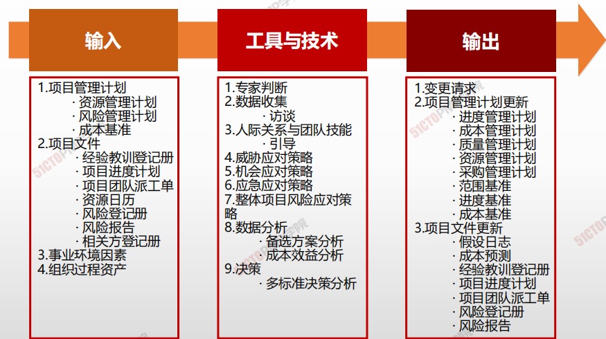
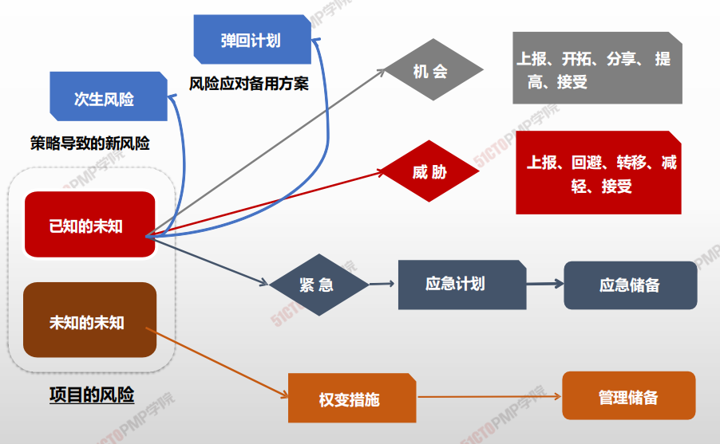

# 实施定性风险分析

## 4W1H

| 4W1H                | **规划风险应对**                                             |
| ------------------- | :----------------------------------------------------------- |
| what 做什么     | 规划风险应对是为处理整体项目风险敞口，以及应对单个项目风险，而制定可选方案、选择应对策略并商定应对行动的过程。 <u>作用：制定应对整体项目风险和单个项目风险的适当方法；本过程还将分配资源，并根据需要将相关活动添加进项目文件和项目管理计划。</u> |
| why 为什么做    | 有效和适当的风险应对可以最小化单个威胁，最大化单个机会，并降低整体项目风险敞口；不恰当的风险应对则会适得其反。 |
| who 谁来做      | 项目经理与项目管理团队以及具备威胁应对、机会应对、应急应对专业知识的 个人或小组 |
| when 什么时候做 | 本过程需要在整个项目期间开展。                               |
| how 如何做      | 要为实施商定的风险应对策略，包括主要策略和备用策略（若必要），制定具体的应对行动。如果选定的策略并不完全有效，或者发生了已接受的风险，就需要制定应急计划（或弹回计划）。同时，也需要识别次生风险。次生风险是实施风险应对措施而直接导致的风险。往往需要为风险分配时间或成本应急储备，并可能需要说明动用应急储备的条件。 <u>专家判断、数据收集、人际关系与团队技能、威胁应对策略、机会应对策略、应急应对策略、整体项目风险应对策略、数据分析、决策</u> |

## 输入/工具技术/输出

1. 输入
   1. 项目管理计划
      - 资源管理计划
      - 风险管理计划
      - 成本基准
   2. 项目文件
      - 经验教训登记册
      - 项目进度计划
      - 项目团队派工单
      - 资源日历
      - 风险登记册
      - 风险报告
      - 相关方登记册
   3. 事业环境因素
   4. 组织过程资产
2. 工具与技术
   1. 专家判断
   2. 数据收集
      - 访谈
   3. 人际关系与团队技能
      - 引导
   4. 威胁应对策略
   5. 机会应对策略
   6. 应急应对策略
   7. 整体项目风险应对策略
   8. 数据分析
      - 备选方案分析
      - 成本效益分析
   9. 决策
      - 多标准决策
3. 输出
   1. 变更请求
   2. 项目管理计划更新
      - 进度管理计划
      - 成本管理计划
      - 质量管理计划
      - 资源管理计划
      - 采购管理计划
      - 范围基准
      - 进度基准
      - 成本基准
   3. 项目文件更新
      - 假设日志
      - 成本预测
      - 经验教训登记册
      - 项目进度计划
      - 项目团队派工单
      - 风险登记册
      - 风险报告

## 规划风险应对

| 策略 | 特点 | 情景 |
| ---- | ---- | ---- |
|开拓 |消除积极风险的不确定性，确保机会出现|• 分配组织中最好的资源：最好的人，最大的经费保障，最优惠的政策，一把手领导亲自带队 • 用新技术，节约成本 • 用高能力人员提前完工 • 穷尽全部可能性，消除不确定性 |
|分享| 充分利用机会，使各方都从中受益|• 建立合作关系，共担责任 • 共享发生利益 • 成立联合体进行投标或组建合资公司提高 提高发生概率、扩大发生影响 • 更加努力学习 • 增加资源以提前完工 • 加强宣传 |
|接受 机会|发生乐以利用|• 不主动促使发生，乐意在发生时利用 • 不大的机会 • 可列入观察清单|
|上报| 上报给管理层| • 项目集、项目组合、整个组织层面，不在项目范围内 • 应对措施超出项目经理的权限|
|回避Avoid | 取消整个项目，以完全消除威胁使目标不受威胁影响|• 去掉WBS中有风险的工作包 • 或由第三方来消除 • 排除风险起源、延长进度、减少范围、改变策略|
| 缓解、减轻Mitigate | 降低概率或后果 | • 雇佣有经验的雇员，更多测试 • 设置警示标志 • 设置备用部件 • 使用优质供应商  |
|转移Transference |转给第三方|• 购买保险或第三方担保，履约保证书，担保书、保证书 • 签订风险转移合同 • 要求提交担保 |
|积极接受Acceptance|准备备用计划\准备应急储备金\列入观察清单|• 能承受的威胁 • 有风险不能回避和减轻，准备备用计划，建立应急储备|
| 被动接受Acceptance | 什么都不作 | • 无法用其他策略 |
| 上报 | 上报给管理层 | • 项目集、项目组合、整个组织层面，不在项目范围内 • 应对措施超出项目经理的权限 |

## 风险应对策略

----

1. 规划风险应对是为处理整体项目风险敞口，以及
应对单个项目风险，而制 定可选方案、选择应对
策略并商定应对行动的过程
2. 威胁有五种应对策略，包括上报、规避、转移、
减轻和接受
3. 机会的应对策略也有五种，包括上报、开拓、提
高、分享和接受