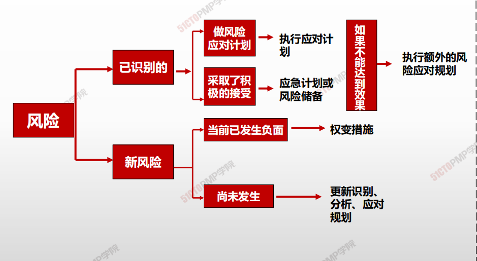
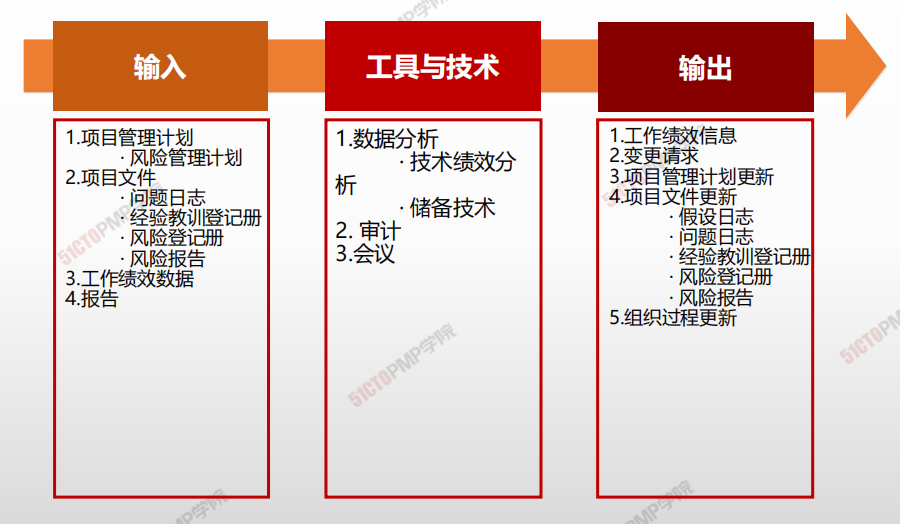
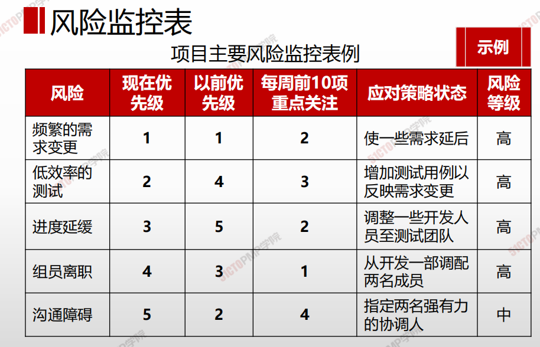
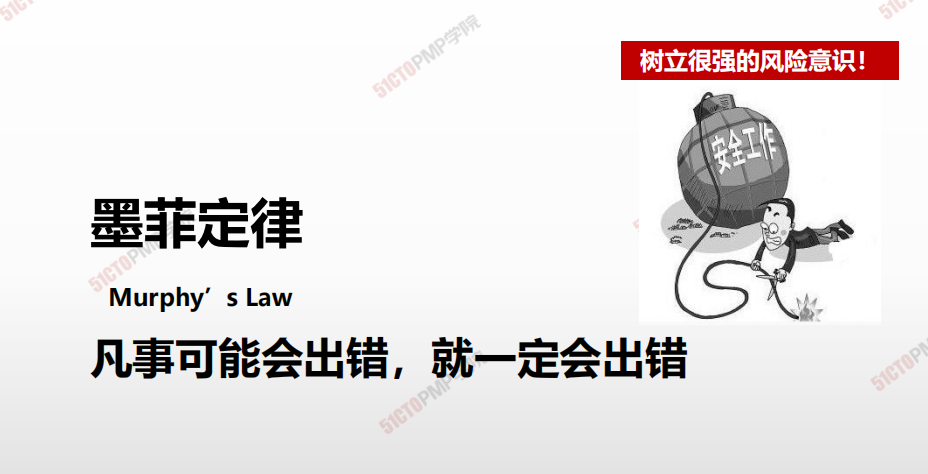
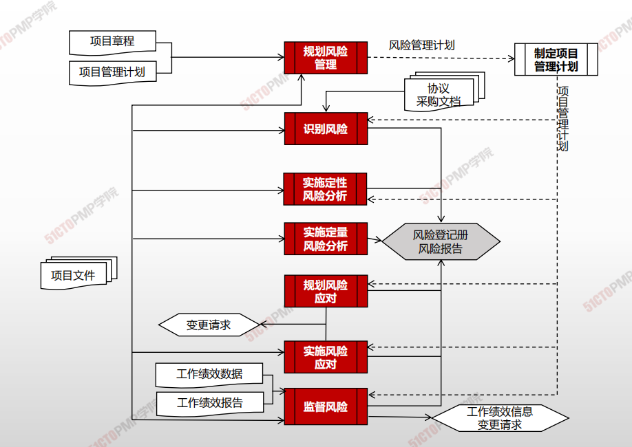

# 监督风险

## 4W1H

| 4W1H                | 监督风险                                                     |
| ------------------- | :----------------------------------------------------------- |
| what 做什么     | 监督风险是在整个项目期间，监督商定的风险应对计划的实施、跟踪已识别风险、识别和分析新风险，以及评估风险管理有效性的过程。 作用：使项目决策都基于关于整体项目风险敞口和单个项目风险的当前信息 |
| why 为什么做    | 为了确保项目团队和关键相关方了解当前的风险敞口级别。         |
| who 谁来做      | 项目经理和项目团队                                           |
| when 什么时候做 | 本过程需要在整个项目期间开展。                               |
| how 如何做      | 应该通过监督风险过程对项目工作进行持续监督，来发现新出现、正变化和已过时的单个项目风险。 数据分析、审计、会议 |

## 输入/工具技术/输出

1. 输入
   1. 项目管理计划
      - 风险管理计划
   2. 项目文件
      - 问题日志
      - 经验教训登记册
      - 风险登记册
      - 风险报告
   4. 工作绩效数据
   4. 报告
2. 工具与技术
   1. 数据分析
      - 技术绩效分析
      - 储备技术
   2. 审计
   3. 会议
3. 输出
   1. 工作绩效信息

   2. 变更请求

   3. 项目管理计划更新

   4. 项目文件更新

      - 假设日志

      - 问题日志
      - 经验教训登记册
      - 风险登记册
      - 风险报告

   5. 组织过程更新

