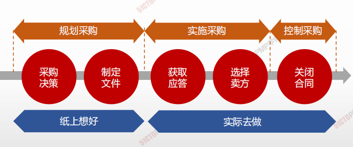

# 采购管理概述

| 12.1 | 规划采购管理 | 记录项目采购决策、明确采购方法，及识别潜在卖方的过程         |
| ---- | ------------ | ------------------------------------------------------------ |
|12.2 | 实施采购     | 获取卖方应答、选择卖方并授予合同的过程。                     |
| 12.3 | 控制采购     | 管理采购关系、监督合同绩效、实施必要的变更和纠偏，以及关闭合同的过程。 |

| **规划采购管理** | **实施采购** | **控制采购** |
| ---------------- | ------------ | ------------ |
|1.编制采购管理计划，做出并记录采购决策|1.发出招标文件，获取卖方应答|1.管理合同关系，监督合同绩效|
|2.编制招标文件和其他相关文件|2.评审卖方建议书，选择卖方 |2.开展必要的纠偏和变更|
|3.识别潜在卖方（有资格来投标 的厂家）|3.授予合同 |3.核实和移交成果，关闭合同， 总结经验教训|

1. 一步做决策---自制还是外购的决策
2. 二步做准备—准备招投标文件-------一步二步做规划
3. 三步做筛选—选出3家或3家以上（初步筛选）不足三家要废标
4. 四步做选择---选择1家最适合—评标、授标（发出中标通知书，
   告知投标人我接收你们的方案和报价）、签订合同---三步、
   四步做实施
5. 五步做合同---合同管理---控制采购
6. 六步做收尾---结束采购---五步、六步做控制 
7. 一法：采购看优选，合同看条款