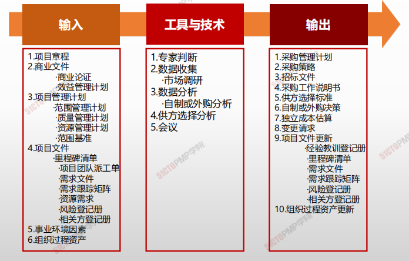
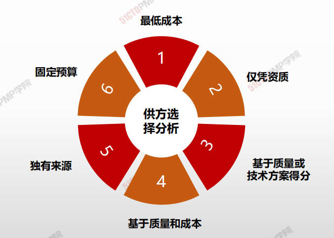
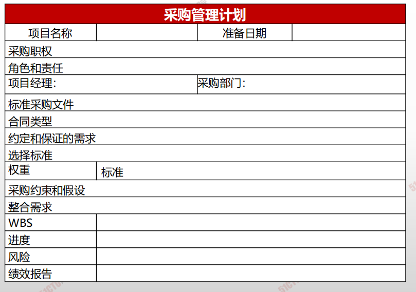
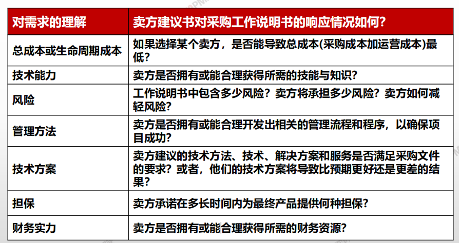
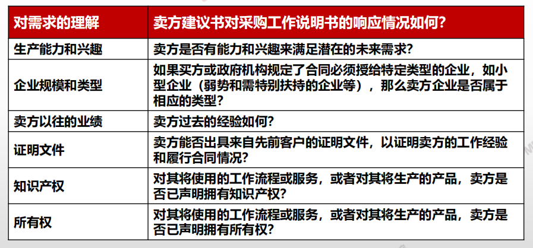

# 规划采购管理

## 4W1H

| 4W1H                | **规划采购管理**                                             |
| ------------------- | ------------------------------------------------------------ |
| what 做什么     | 记录项目采购决策、明确采购方法，及识别潜在卖方的过程。 作用：确定是否从项目外部获取货物和服务，如果是，则还要确定将在什么时间、以什么方式获取什么货物和服务 |
| why 为什么做    | 项目进度计划对规划采购管理过程中的采购策略制定有重要影响。为如何采购指定规矩，制定原则，明确采购方法，识别潜在卖方。 |
| who 谁来做      | 项目经理                                                     |
| when 什么时候做 | 本过程仅开展一次或仅在项目的预定义点开展                     |
| how 如何做      | 应该在规划采购管理过程的早期，确定与采购有关的角色和职责。项目经理应确保在项目团队中配备具有所需采购专业知识的人员。 **专家判断、数据收集、数据分析、供方选择分析、会议** |

## 输入/工具技术/输出

1. 输入

   1. 项目章程
   2. 商业文件
      - 商业论证
      - 效益管理计划
   3. 项目管理计划
      - 范围管理计划
      - 质量管理计划
      - 资源管理计划
      - 范围基准
   4. 项目文件
      - 里程碑清单
      - 项目团队派工单
      - 需求文件
      - 需求跟踪矩阵
      - 资源需求
      - 风险等级册
      - 相关方登记册
   5. 事业环境因素
   6. 组织过程资产

2. 工具与技术

   1. 专家判断
   2. 数据收集
      - 市场调研
   3. 数据分析
      - 自制或外购分析
   4. 供方选择分析
   5. 会议

3. 输出

   1. 采购管理计划
   2. 采购决策
   3. 招标文件
   4. 采购工作说明书
   5. 供方选择标准
   6. 自制或外购决策
   7. 独立成本估算
   8. 变更请求
   9. 项目文件更新
      - 经验教训登记册
      - 里程碑清单
      - 需求文件
      - 需求跟踪矩阵
      - 风险登记册
      - 相关方登记册
   10. 组织过程资产更新

   

## 自制/外购分析

## 供方选择分析

## -采购管理计划

**项目管理计划的组成部分**

**采购管理计划的主要内容包括：**

- 如何协调采购与项目的其他工作
- 开展重要采购活动的时间表；
- 用于管理合同的采购测量指标；
- 与采购有关的相关方角色和职责；
- 是否需要编制独立估算，是否应将其作为评价标准；
- 风险管理事项；
- 拟使用的预审合格的卖方（如果有）。

## 采购工作说明书

- 对将要包含在相关合同中的那一部分**项目范围进行定义**
- 应**详细描述**拟采购的产品、服务或成果
- 包括规格、所需数量、质量水平、绩效数据、履约期限、工作地点和其他需求
- 要求：**清晰、完整、简练**

## 供方选择标准

---

1. 规划采购管理是记录项目采购决策、明确采购方
法，及识别潜在卖方的过程
2. 应该针对项目范围中已知的工作，编制采购工作
说明书SOW