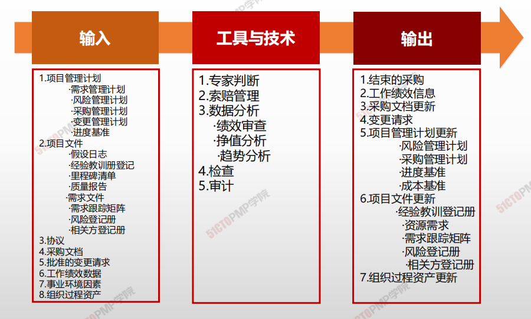
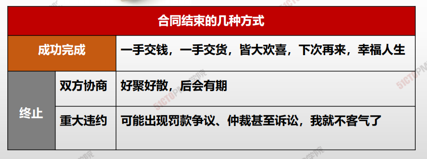
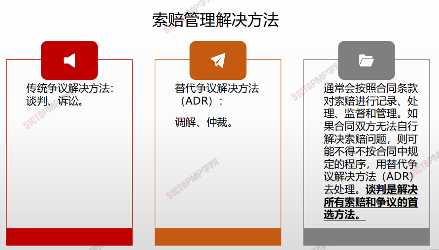
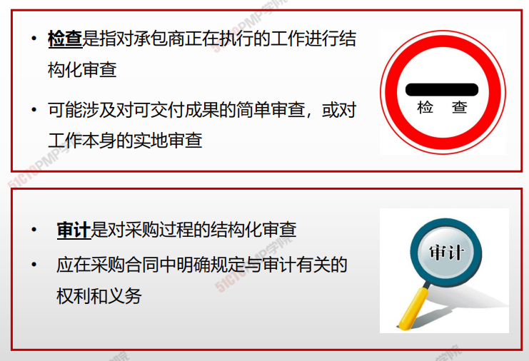
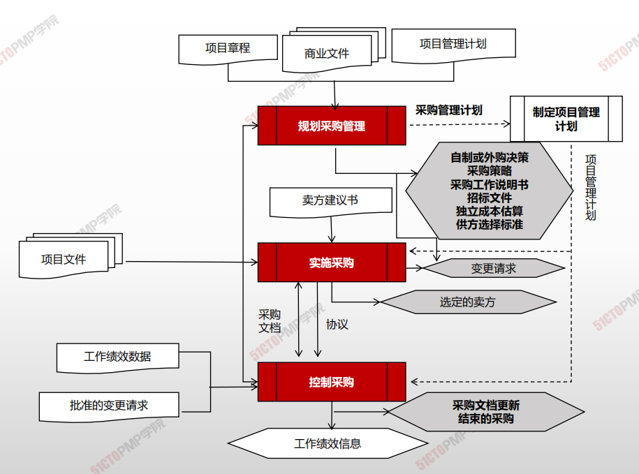

# 控制采购

## 在控制采购过程中：

- **第一：要对卖方的工作情况进行检查。**
- 第二：要使用数据分析中的挣值分析来计算进度和成本绩效指标，并据此**进行进度和成本绩效的趋势分析。**
- 第三：**要定期或不定期地开展审计，总结合同履行方面的经验教训，****提出相应的变更请求。
- **第四：要使用数据分析中的**绩效审查**，确定卖方的工作绩效和工作能力是否令买方满意，以决定该卖方是否适合承接以后类似的工作。**
- **第五：要通过**索赔管理**去预防、记录和处理卖方向买方的索赔。

## 合同管理活动：

- 收集数据和管理项目记录，包括维护对实体和财务绩效的详细记录，以及建立可测量的采购绩效指标；
- 完善采购计划和进度计划；
- 建立与采购相关的项目数据的收集、分析和报告机制，并为组织编制定期报告；监督采购环境，以便引导或调整实施；
- 向卖方付款

## 索赔

索赔是一方遭受了某种不该自己承担的实际损失（包括金钱或时间损失），而基于法律或合同规定向对方提出的补偿请求。**索赔的实质是****要求损失补偿，不带任何惩罚性质。**

虽然合同任何一方都可以向对方索赔，但一般只讨论卖方（承包商）向买方（业主）的索赔。

索赔可以分成不同的类别，如**工期延误索赔、赶工索赔、**变更索赔、不利现场条件索赔、违约索赔。

## 4W1H

| 4W1H                | 控制采购                                                     |
| ------------------- | ------------------------------------------------------------ |
| what 做什么     | 管理采购关系，监督合同绩效，实施必要的变更和纠偏，以及关闭合同的过程。 <u>作用：确保买卖双方履行法律协议，满足项目需求</u> |
| why 为什么做    | 为保证采购活动顺利进行，采购物品符合项目要求                 |
| who 谁来做      | 组织中的职能部门或项目经理                                   |
| when 什么时候做 | 执行采购时做。                                               |
| how 如何做      | 采用合同变更控制系统，采购绩效审查，检查与审计，绩效报告，<支付系统，索赔管理和记录管理系统来管理采购。 <u>专家判断、索赔管理、数据分析、检查、审计</u> |

## 输入/工具技术/输出

1. 输入

   1. 项目管理计划
      - 需求管理计划
      - 风险管理计划
      - 采购管理计划
      - 变更管理计划
      - 进度基准
   4. 项目文件
      - 假设日志
      - 经验教训登记册
      - 里程碑清单
      - 质量报告
      - 需求文件
      - 风险登记册
      - 相关方登记册
   3. 采购文档
   4. 协议
   7. 批准的变更请求
   8. 工作绩效数据
   9. 事业环境因素
   10. 组织过程资产

2. 工具与技术

   1. 专家判断
   2. 索赔管理
   3. 数据分析
      - 绩效审查
      - 挣值分析
      - 趋势分析
   4. 检查
   5. 审计

3. 输出

   1. 结束的采购
   2. 工作绩效信息
   3. 采购文档更新
   4. 变更请求
   5. 项目管理计划更新
      - 风险管理计划
      - 采购管理计划
      - 进度基准
      - 成本基准
   6. 项目文件更新
      - 经验教训登记册
      - 资源需求
      - 需求跟踪矩阵
      - 风险登记册
      - 相关方登记册
   7. 组织过程资产更新
   
   

# 索赔管理

## 检查&审计

