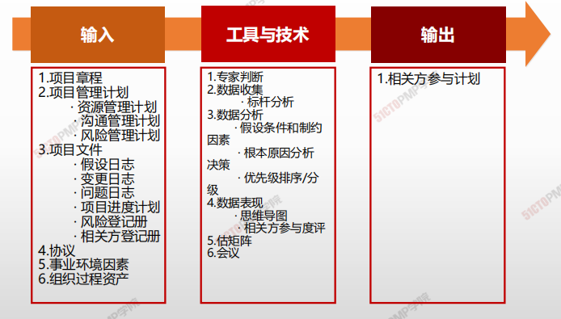
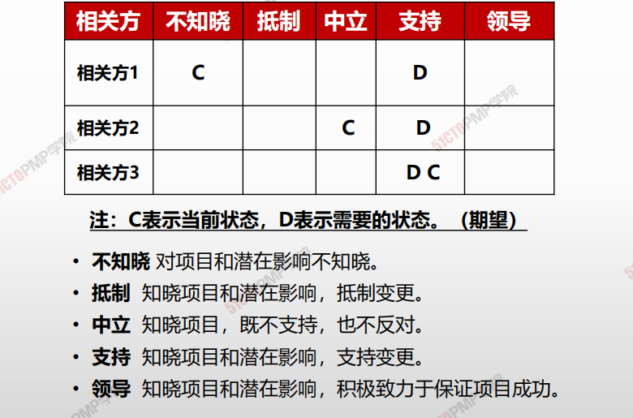
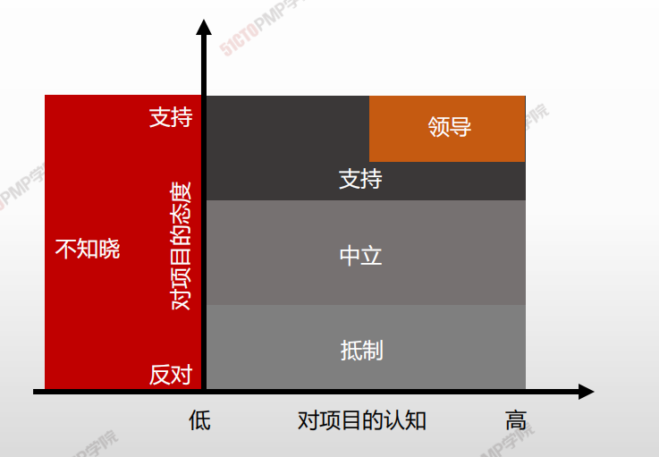
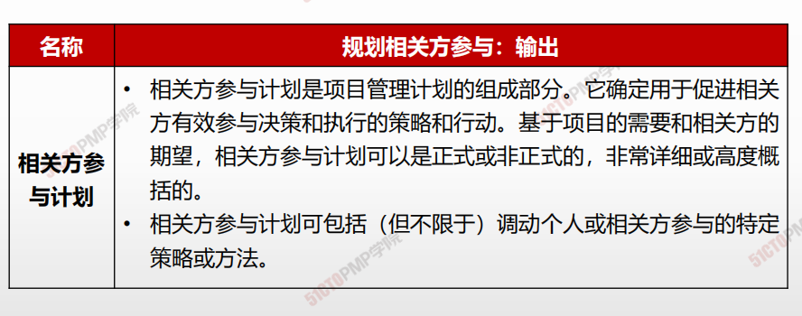
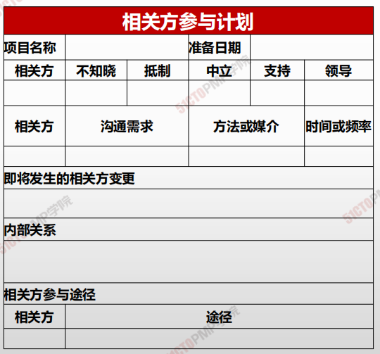

# 规划相关方参与

## 4W1H

| 4W1H                | **规划相关方参与**                                           |
| ------------------- | ------------------------------------------------------------ |
| what 做什么     | 规划相关方参与是根据相关方的需求、期望、利益和对项目的潜在影响，制定项目相关方参与项目的方法的过程。 <u>作用：</u>提供与相关方进行有效互动的可行计划 |
| why 为什么做    | 为管理相关方提供指南。                                       |
| who 谁来做      | 项目经理和项目管理团队。                                     |
| when 什么时候做 | 项目早期，尽早规划相关方管理，可以降低项目风险。             |
| how 如何做      | 为满足项目相关方的多样性信息需求，应该在项目生命周期的早期制定一份有效的计划；然后，随着相关方社区的变化，定期审查和更新该计划。 <u>专家判断、数据收集、数据分析、决策、数据表现、会议</u> |

## 输入/工具技术/输出

1. 输入

   1. 项目章程
   3. 项目管理计划
      - 资源管理计划
      - 沟通管理计划
      - 风险管理计划
   4. 项目文件
      - 假设日志
      - 变更日志
      - 问题日志
      - 项目进度计划
      - 风险登记册
      - 相关方登记册
   5. 协议
   6. 事业环境因素
   7. 组织过程资产

2. 工具与技术

   1. 专家判断
   2. 数据收集
      - 标杆分析
   3. 数据分析
      - 假设条件和制约因素
      - 根本原因分析决策
      - 优先级排序/分级
   4. 数据表现
      - 思维导图
      - 相关方参与度评估矩阵
   5. 会议

3. 输出

   1. 相关方参与计划
   
   

## 相关方参与度评估矩阵

## 相关方参与计划

> **确定用于促进相关方有效参与决策和执行的策略和行动**

### **相关方参与计划**

- **相关方登记册内容**
- **相关方参与度评估矩阵**
- **相关方之间的关系**

- **管理策略和措施**
- **与沟通计划的关系**
- **相关方变更管理**

