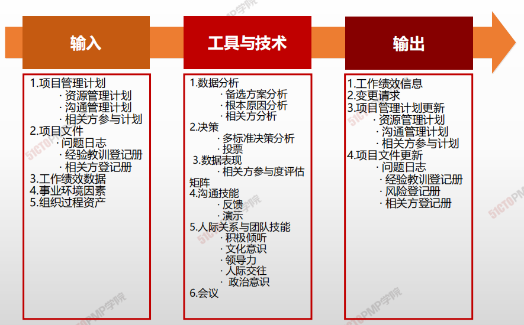
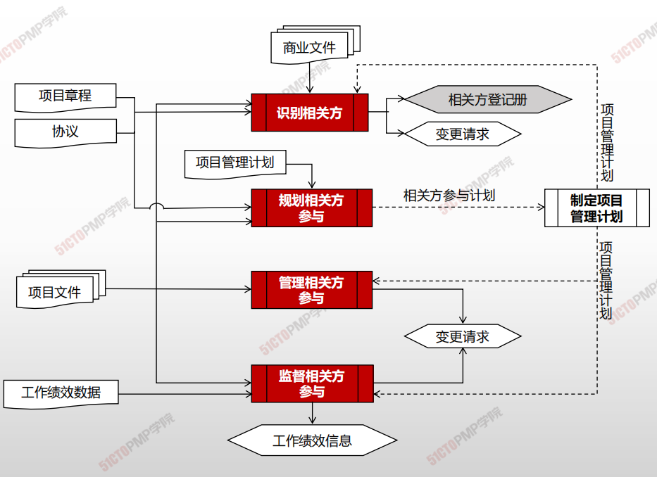
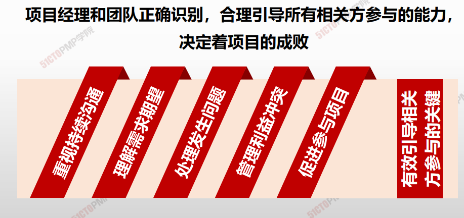

# 监督相关方参与

## 4W1H

| 4W1H                | **监督相关方参与**                                           |
| ------------------- | ------------------------------------------------------------ |
| what 做什么     | 监督相关方参与是监督项目相关方关系，并通过修订参与策略和计划来引导相关方合理参与项目的过程。 <u>作用：</u>随着项目进展和环境变化，维持或提升相关方参与活动的效率和效果。 |
| why 为什么做    | 随着项目进展和环境变化，维持或提升相关方参与活动的效率和效果。 |
| who 谁来做      | 项目管理团队。                                               |
| when 什么时候做 | 本过程需要在整个项目期间开展                                 |
| how 如何做      | 关键绩效，关注参与度，灵活调整策略。 <u>数据分析、决策 、数据表现、沟通技能、人际关系与团队技能、会议</u> |

## 输入/工具技术/输出

1. 输入

   3. 项目管理计划
      - 资源管理计划
      - 沟通管理计划
      - 相关方管理计划
   2. 项目文件
      - 问题日志
      - 经验教训登记册
      - 相关方登记册
   5. 工作绩效数据
   6. 事业环境因素
   7. 组织过程资产
   
2. 工具与技术

   1. 数据分析
      - 备选方案分析
      - 根本原因分析
      - 相关方分析
   2. 决策
      - 多标准决策分析
      - 投票
   3. 数据表现
      - 相关方参与度评估矩阵
   4. 沟通技能
      - 反馈
      - 演示
   5. 人际关系与团队技能
      - 积极倾听
      - 文化意识
      - 领导力
      - 人际交往
      - 政治意识
   6. 会议

3. 输出

   1. 工作绩效信息
   2. 变更请求
   3. 项目管理计划更新
      - 资源管理计划
      - 沟通管理计划
      - 相关方参与计划
   4. 项目文件更新

   

   ---

   

   1. 监督相关方参与是监督项目相关方关系，并通
   过修订参与策略和计划来引导相关方合理参与
   项目过程
   2. 通过获得反馈确保发送给相关方的信息被接收
   和理解
   3. 通过积极倾听，减少理解错误和沟通错误
   4. 使用相关方参与度评估矩阵，来跟踪每个相关
   方参与水平的变化，对相关方参与加以监督
   5. 工作绩效信息记录了相关方当前支持水平与期
   望参与水平进行比较的结果

   

   

