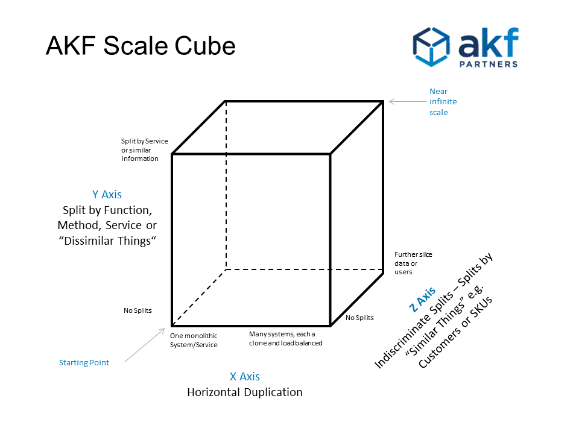
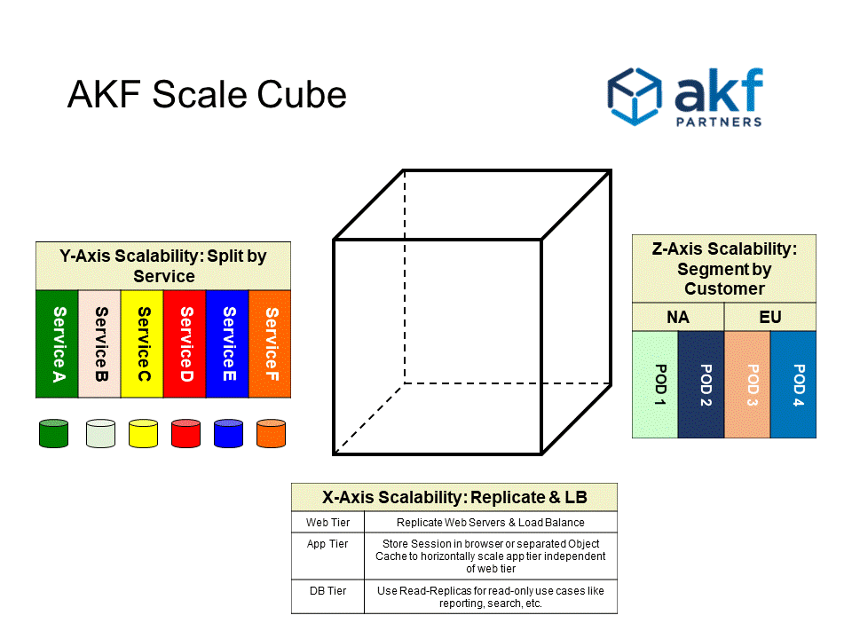
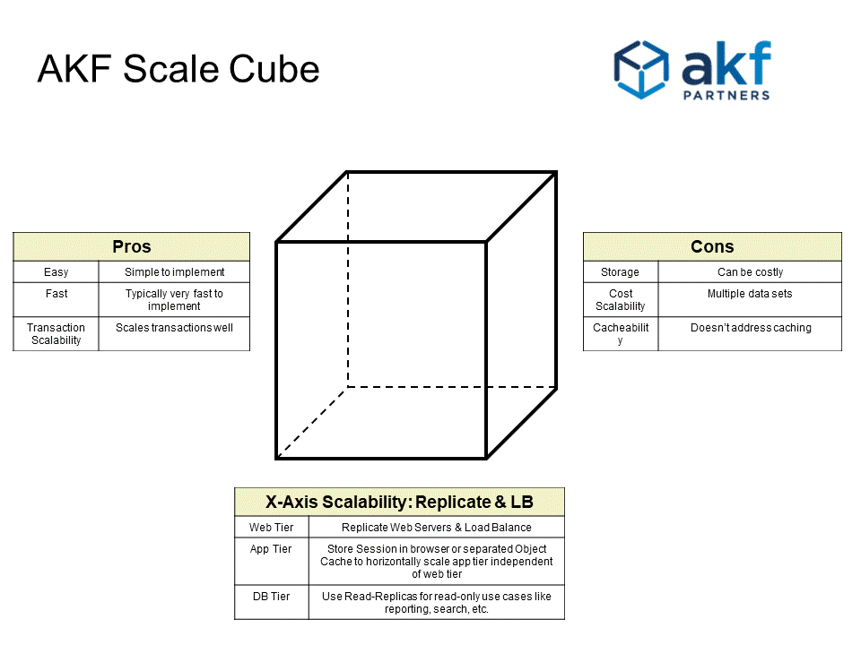
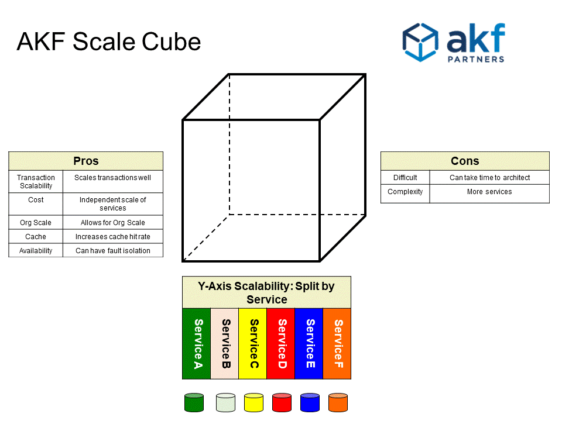
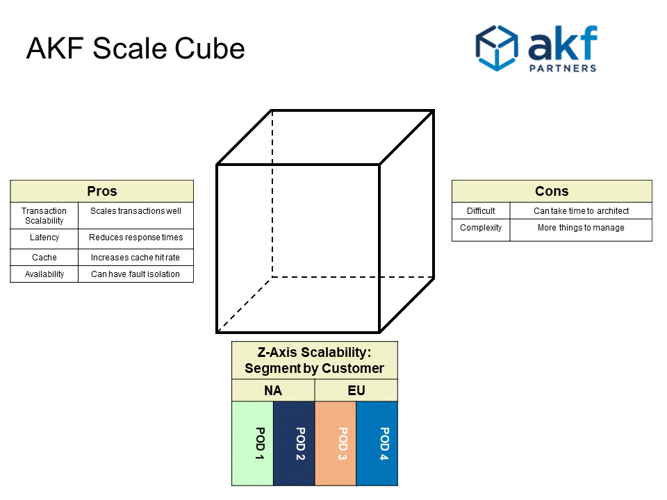

 Scale Cube 是一个用于分割服务、定义微服务和扩展产品的模型。它还为团队创建了一种通用语言，可以在设计解决方案时讨论与规模相关的选项。它可以与其兄弟[Availability Cube](https://akfpartners.com/growth-blog/akf-availability-cube)搭配使用，以确保解决方案的可扩展性和可用性。

 

 ## 3 缩放的维度

 Scale Cube（有时称为“AKF Scale Cube”或“AKF Cube”）由 3 个轴组成： 

   • X 轴：服务和数据的水平复制和克隆
   • Y 轴：功能分解和分段 - 微服务（或微服务）
   • Z 轴：沿客户边界的服务和数据分区 - 分片/Pod

 这些轴及其含义如下图 1 所示。

 

 ​                  图1

 下面的图 2 显示了如何在现代架构中部署多维数据集，分解服务（有时称为微服务架构）、克隆服务和数据源以及将客户等类似对象划分为“pod”。

 

 ​                  图2

------

 **
 使用 Scale Cube 的 X 轴缩放**

 扩展解决方案最常用的方法是在负载均衡器（也称为 X 轴扩展）后面运行应用程序的多个相同副本。这是提高应用程序容量和可用性的好方法。

 使用 X 轴缩放时，每个服务器都运行服务（如果已分解）或单体的相同副本。X 轴的一个好处是它通常在智力上很容易实现，并且从交易的角度来看它可以很好地扩展。实现 X 轴的障碍包括大量与会话相关的信息，这些信息通常难以分发或需要持久化到服务器——这两者都会导致可用性和可扩展性问题。X 轴的比较缺点是，虽然在智力上易于实施，但必须完整复制数据集，这增加了运营成本。此外，随着数据量随着交易量的增加而增加，缓存往往会在许多级别上降级。最后，X 轴不会产生更高级别的组织规模。

 图 3 解释了 X 轴可扩展性的优缺点，并通过传统的 3 层架构来解释它是如何实现的。

 

 ​                  图 3

------

 **
 使用 Scale Cube 的**
 Y 轴扩展 Y 轴扩展（想想面向服务的架构、微服务或单体的功能分解）侧重于沿名词或动词边界分离服务和数据。这些分裂彼此“不同”。商业解决方案中的示例可能是从浏览中拆分搜索、从添加到购物车的结账、从帐户状态中的登录等。在实现拆分时，Y 轴缩放将单体应用程序拆分为一组服务。每个服务都实现了一组相关的功能，例如订单管理、客户管理、库存等。此外，每个服务都应该有自己的、非共享的数据，以确保高可用性和故障隔离。Y 轴缩放与多维数据集的所有轴共享增加事务可扩展性的好处。

 此外，由于 Y 轴允许对团队进行细分以及代码和数据的所有权，因此提高了组织的可扩展性。缓存命中率应该随着数据和服务的适当分段而增加，并且可以将类似大小的内存空间分配给由相对较少的事务访问的较小数据集。由于系统可以缩小到商用服务器或可以使用更小的 IaaS 实例，因此运营成本通常会降低。

 图 4 解释了 Y 轴可扩展性的优缺点，并显示了一个故障隔离的服务示例，每个服务都有自己的数据存储，用于故障隔离。

 

 ​                  图 4

------

 **
 使用缩放立方体的 Z 轴缩放**

 Y 轴处理不同事物的分割（通常沿着名词或动词边界），Z 轴处理“相似”事物的分割。示例可能包括沿customer_id 的无偏模数或沿有些偏向（但有利于响应时间）的地理边界拆分客户。产品目录可以按 SKU 拆分，内容可以按 content_id 拆分。Z 轴缩放与所有轴一样，提高了解决方案的事务可扩展性，并且如果故障隔离了它的可用性。因为部署到服务器的软件在每个 Z 轴分片中本质上是相同的（但数据是不同的），所以组织的可扩展性没有增加。缓存命中率通常随着较小的数据集而上升，而随着可以使用商品服务器或较小的 IaaS 实例，运营成本通常会下降。

 图 5 解释了 Z 轴可扩展性的优缺点，并显示了一个故障隔离的 pod 结构，在美国有 2 个独特的客户 pod，在欧盟有 2 个。请注意，Z 轴比例的另一个好处是能够对 Pod 进行分割，以符合当地的隐私法，例如欧盟的 GDPR。

 

 ​                  图5

------

 **概括**

 使用 Scale Cube 来确定通过克隆/复制（X 轴）、服务和资源细分（Y 轴）以及客户/地理细分（Z 轴）来提高可扩展性的机会。 
 与 Scale Cube 密切相关的是[Availability Cube](https://akfpartners.com/growth-blog/akf-availability-cube)。应同时考虑这两者，以帮助构建可扩展且可用的解决方案。

------

 **Scale Cube 历史**
 AKF Partners 于 2007 年发明了 Scale Cube，并在我们的博客（[此处为原始文章](https://akfpartners.com/growth-blog/splitting-applications-or-services-for-scale)）在线发布，随后在我们的第一本书[The Art of Scalability](http://theartofscalability.com/)和我们的第二本书[Scalability Rules 中发布](http://www.scalabilityrules.com/)。

 AKF Partners 已经创建了许多其他模型来更好地理解[可用性](https://akfpartners.com/growth-blog/akf-availability-cube)、[会话和状态](https://akfpartners.com/growth-blog/the-akf-partners-session-state-cube)、[安全监控](https://akfpartners.com/growth-blog/akf-security-insights-cube)和[租赁的概念](https://akfpartners.com/growth-blog/multi-tenant-defined)。

 *AKF Partners 已帮助数百家大大小小的公司采用 AKF Scale Cube 来扩展他们的技术产品解决方案。我们于 2007 年开发了 Cube 以帮助客户扩展他们的产品，并一直使用它来帮助一些有史以来最伟大的在线品牌蓬勃发展并取得成功。对于那些对“时间旅行”感兴趣的人，这里是 2007 年关于[Cube 的](https://akfpartners.com/growth-blog/splitting-applications-or-services-for-scale)2 个原始帖子： [Application Cube](https://akfpartners.com/growth-blog/splitting-applications-or-services-for-scale) , [Database Cube](https://akfpartners.com/growth-blog/splitting-databases-for-scale)*
