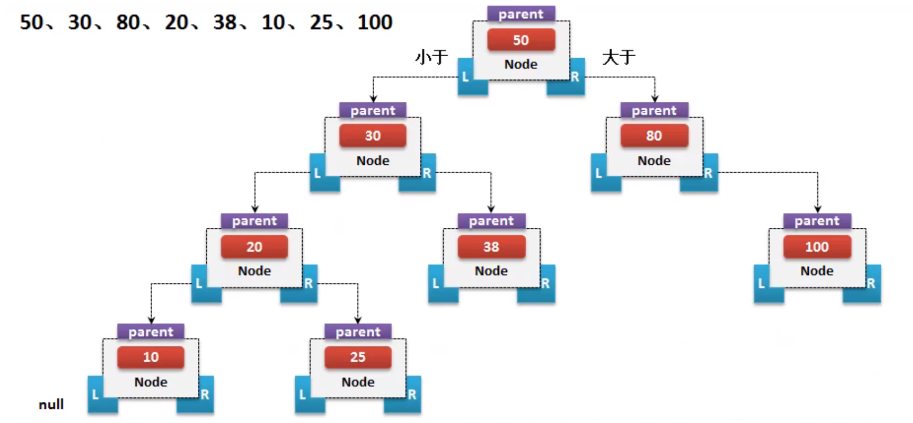
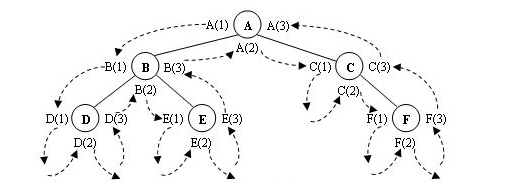
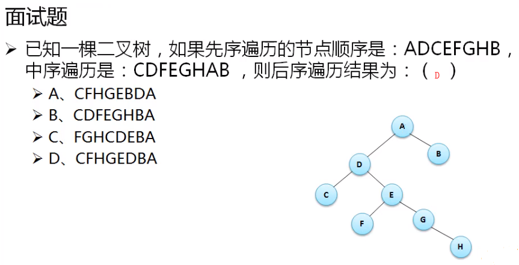
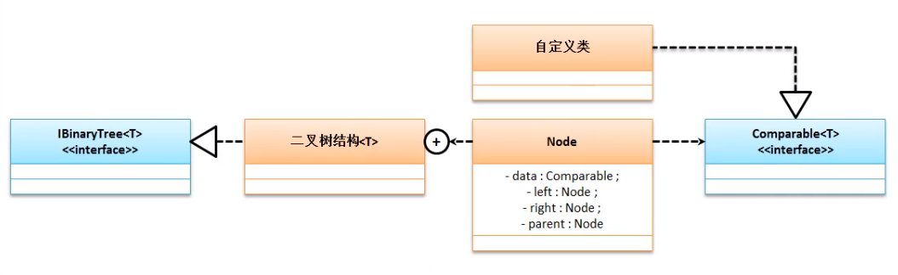

> 数据结构的主要目的是为了进行更加方便的存储和较高性能的查找 , 实际上最早接触道德数据结构就属于数组的相关操作(排序 , 二分查找 ...) , 并非人人都需要掌握数据结构的开发, 如果所有项目都使用这样的开发模式 , 那么基本上这个项目的维护性都是非常低的 , 所有更多的都是应用系统或者第三方写好的数据结构来实现的 .

链表是基础的线性数据结构 , 在进行链表操作的时候使用若干个节点 用于数据的存储 , 在进行数据存储的过程中 , 由于本身不具有排序的特点 , 所以在使用链表查询数据是 , 它的时间复杂度是 "O(n)" , 链表可以实现的优化方案使用跳表的方案来完成 , 实际上和二分查找的意义一样 , 利用排序的模式 , 随机抽取几个中心点进行若干的比较 . 但是比链表存储结构更加高级的就是树状的结构 . 

# 树状结构



树结构的核心思想在于 ,抽取第一个数据作为根节点 , 比第一个数据小的内容放在根节点的 左子树 ,大的放在 右子树上 . 当数据排序完成后可以按照中序遍历的模式进行数据的获取 : 

## ==对于二叉树的遍历方式 :== 


在沿着箭头方向所指的路径对二叉树进行遍历时，每个节点会在这条搜索路径上会==出现三次==，而==访问操作只能进行一次==，这时就需要决定在搜索路径上第几次出现的结点进行访问操作，由此就引出了三种不同的遍历算法。




**1.**      **先序遍历**

若二叉树为非空，则过程为：

（1） 访问根节点。

（2） 先序遍历左子树。

（3） 先序遍历右子树。

图6.13中，先序遍历就是把标号为(1)的结点按搜索路径访问的先后次序连接起来，得出结果为：ABDECF。

**2.**      **中序遍历**

若二叉树为非空，则过程为：

（1） 按中序遍历左子树。

（2） 访问根结点。

（3） 按中序遍历右子树。

图6.13中，先序遍历就是把标号为(2)的结点按搜索路径访问的先后次序连接起来，得出结果为：DBEACF。

**3.**      **后序遍历**

若二叉树为非空，则过程为：

（1） 按后序遍历左子树。

（2） 按后序遍历右子树

（3） 访问根结点。



# 二叉树的基础实现

在整个二叉树的实现过程中最为重要的概念就是进行大小比较 , 而二叉树可以保存任意类型 , 所以此时如果是自定义类或者是系统类就需要做一个统一的规则 , 而这个规则就用比较器进行 , 这个比较器是 `Comparable` . 



范例 :  操作标准

```java
package tree.util;

public interface IBinaryTree<T> {
    void add(T data);
    int size();
    T[] toArray();
}
```

啊啊啊啊啊啊啊啊啊啊啊啊啊啊   好烦  看不懂  以后再看吧  ！！！！

下次从这里看https://www.bilibili.com/video/av54199231/?p=5

