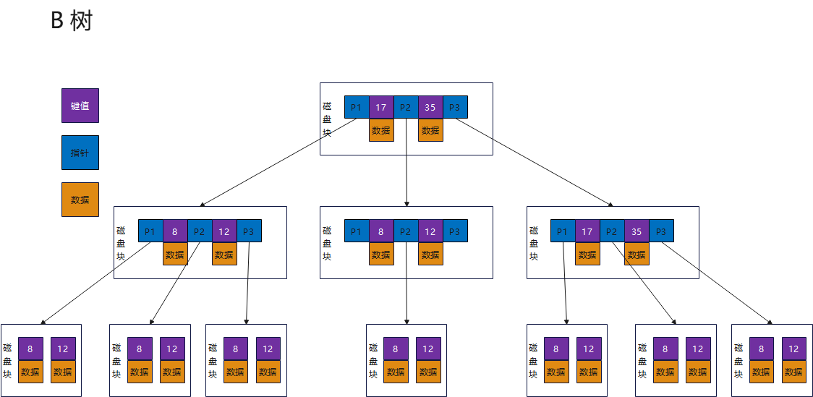
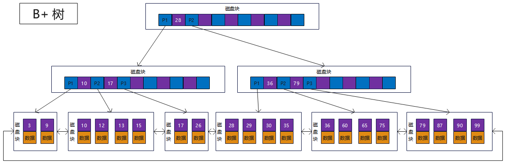
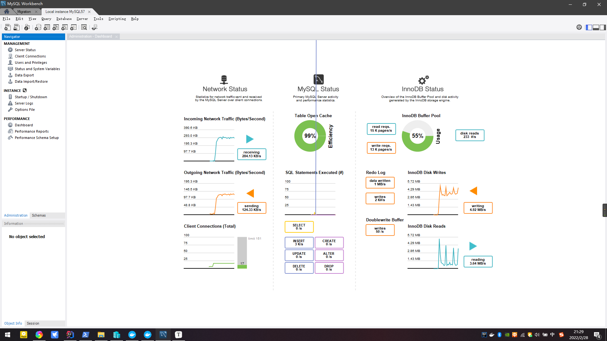
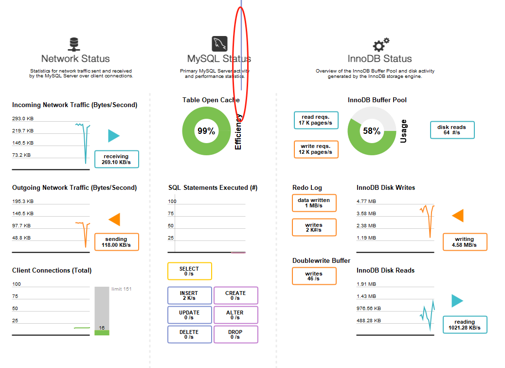
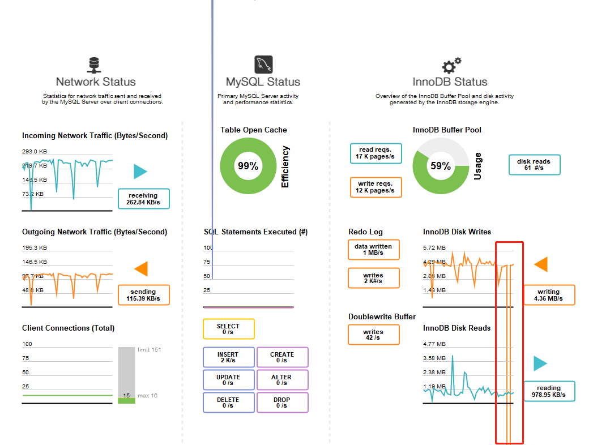
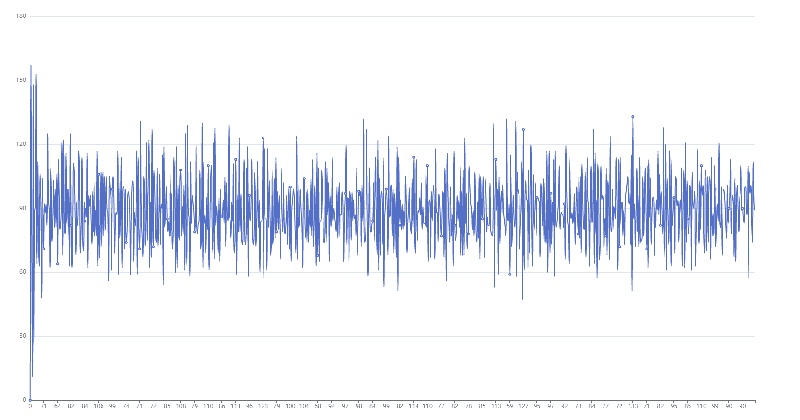

# B 数 和 B+ 数


> B （balance） - 平衡


## B 数 (B-树)

B 数，又称为多路平衡查找树，B树中所有结点的孩子个数的最大值成为B树的阶，通常使用 m 表示。一颗 m 阶 B 树或为空树


### Mysql为什么使用 B+ 树

1. 全部遍历 O(n)
2. hash : 优点：增删改查O(1) ；缺：查找排序 O(n)
3. 二叉树：O(log2(n))；优：深度为N的节点查找次数为 N；缺：如果ID持续增加树不平衡O(n)
4. 平衡二叉树：数据量越大，树高越大；树高导致磁盘IO过多；
5. B树：
    - 优：每个节点可以由多个子节点，可以控制树高问题，比平衡二叉树减少一次磁盘IO
    - 缺：数据库索引是存储在磁盘上的，如果是巨量很大会导致索引很大，当利用错音查找的时候不可能将几个G的索引加载进内存，只能注意加载每个磁盘页，磁盘页对应着索引树的节点。




### B+ 树

所有的 data 数据 都在 **叶子节点中**，而且叶子节点之间会有个指针指向，**这就是B+数据的核心点**，这样可以大大提升 **查询范围**效率，也方便遍历整个树；





1. **叶子节点不再存储数据，数据在同一层的叶子节点上；**
2. 叶子节点之间，增加了 **链表**，获取所有几点，不再需要**<u>中序遍历</u>**；


### B+树的分裂


当一个节点满时，分配新的节点，并将原节点中 1/2 的数据复制到新的节点，最后在父节点中增加新的指针；B+树的分裂只影响原节点和父节点，不会影响兄弟节点，所以他不需要指向兄弟节点；


- B+ 树 与 B树的区别
    - 叶子节点只存储键值信息
    - 所有叶子节点都有一个链指针
    - 数据记录都存放在叶子节点中

#### B+ 优缺点


1. **B+树最大的好处，方便扫库，B树必须用中序遍历扫库**，而B+树直接从叶子节点挨个扫一遍就完了。


2. **B+树支持 <u>range-query</u>（区间查询）非常方便，而B树不支持**；这是数据库选用B+树的最主要原因。

    比如：要查 5-10之间的，B+数据一把到 5 这个标记，在一把到 10，然后就串起来了；

    B树的优势是当你要查的值处在非叶子节点时，当到该飞叶子节点是查找就成功结束了，而B+树还要使用索引去查找数据；


### mysql 中 B+树的极限


# B+树


B+树是B树的一种变型形式，B+树上的叶子节点存储关键字以及相应记录的地址，叶子节点以上各层作为索引使用。一颗m阶的B+树定义如下：


1. 每个节点至多有m个子女
2. 除根节点外，每个节点至少有（m/2）个子女，根节点至少有2个子女；
3. 有k个子女的节点必有k个关键字。


B+树的查找与B树不同，当索引部分某个节点的关键字与所查的关键字相等是，并不停查找，应继续沿着这个关键字左边的指针向下，一直查到关键字所在的叶子节点上为止；


# Mysql测试


保存3亿条数据

```java
    @Test
    @PerfTest(invocations = 20000, threads = 20)
    public void save(){
        bTreeService.save(10000);;
    }
```


数据库性能爆炸





写 平均4mb/s

发送 平均 130kb/s

读取 平均 3mb/s 到 600kb/s

insert 平均 3kb/s 到 6kb/s





有根线已经漂出去了


发现错误

```
cn.btree.BTreeServiceTest.save
2022-02-28 21:39:49.571  WARN 16784 --- [      Thread-12] o.h.engine.jdbc.spi.SqlExceptionHelper   : SQL Error: 0, SQLState: null
2022-02-28 21:39:49.572 ERROR 16784 --- [      Thread-12] o.h.engine.jdbc.spi.SqlExceptionHelper   : DatebookHikariCP - Connection is not available, request timed out after 4014ms.
2022-02-28 21:39:49.579  WARN 16784 --- [      Thread-19] o.h.engine.jdbc.spi.SqlExceptionHelper   : SQL Error: 0, SQLState: null
2022-02-28 21:39:49.579  WARN 16784 --- [      Thread-10] o.h.engine.jdbc.spi.SqlExceptionHelper   : SQL Error: 0, SQLState: null
2022-02-28 21:39:49.579  WARN 16784 --- [      Thread-21] o.h.engine.jdbc.spi.SqlExceptionHelper   : SQL Error: 0, SQLState: null
2022-02-28 21:39:49.579 ERROR 16784 --- [      Thread-19] o.h.engine.jdbc.spi.SqlExceptionHelper   : DatebookHikariCP - Interrupted during connection acquisition
2022-02-28 21:39:49.579  WARN 16784 --- [       Thread-2] o.h.engine.jdbc.spi.SqlExceptionHelper   : SQL Error: 0, SQLState: null
2022-02-28 21:39:49.579  WARN 16784 --- [       Thread-7] o.h.engine.jdbc.spi.SqlExceptionHelper   : SQL Error: 0, SQLState: null
2022-02-28 21:39:49.579  WARN 16784 --- [       Thread-4] o.h.engine.jdbc.spi.SqlExceptionHelper   : SQL Error: 0, SQLState: null
2022-02-28 21:39:49.579  WARN 16784 --- [       Thread-5] o.h.engine.jdbc.spi.SqlExceptionHelper   : SQL Error: 0, SQLState: null
2022-02-28 21:39:49.579  WARN 16784 --- [      Thread-18] o.h.engine.jdbc.spi.SqlExceptionHelper   : SQL Error: 0, SQLState: null
2022-02-28 21:39:49.580 ERROR 16784 --- [       Thread-5] o.h.engine.jdbc.spi.SqlExceptionHelper   : DatebookHikariCP - Interrupted during connection acquisition
2022-02-28 21:39:49.579  WARN 16784 --- [      Thread-13] o.h.engine.jdbc.spi.SqlExceptionHelper   : SQL Error: 0, SQLState: null
2022-02-28 21:39:49.580 ERROR 16784 --- [      Thread-18] o.h.engine.jdbc.spi.SqlExceptionHelper   : DatebookHikariCP - Interrupted during connection acquisition
2022-02-28 21:39:49.579 ERROR 16784 --- [      Thread-10] o.h.engine.jdbc.spi.SqlExceptionHelper   : DatebookHikariCP - Interrupted during connection acquisition
2022-02-28 21:39:49.580 ERROR 16784 --- [      Thread-13] o.h.engine.jdbc.spi.SqlExceptionHelper   : DatebookHikariCP - Interrupted during connection acquisition
2022-02-28 21:39:49.579 ERROR 16784 --- [      Thread-21] o.h.engine.jdbc.spi.SqlExceptionHelper   : DatebookHikariCP - Interrupted during connection acquisition
2022-02-28 21:39:49.580 ERROR 16784 --- [       Thread-7] o.h.engine.jdbc.spi.SqlExceptionHelper   : DatebookHikariCP - Interrupted during connection acquisition
2022-02-28 21:39:49.580 ERROR 16784 --- [       Thread-2] o.h.engine.jdbc.spi.SqlExceptionHelper   : DatebookHikariCP - Interrupted during connection acquisition
2022-02-28 21:39:49.580 ERROR 16784 --- [       Thread-4] o.h.engine.jdbc.spi.SqlExceptionHelper   : 
```


**连接超时**

`DatebookHikariCP - Connection is not available, request timed out after 4014ms. `


**线程池不足**

`DatebookHikariCP - Interrupted during connection acquisition`


**未知的错误**

`o.h.engine.jdbc.spi.SqlExceptionHelper   : SQL Error: 0, SQLState: null`


数据库出现不稳定




2022年2月28日23:16:25  8824667 数据跑了2个小时


明天再看


2022年3月1日08:16:02  8000万数据 , 预计 2个亿没跑完


下班回来看   

  

最终插入了 1.9亿条数据


平均1000 份 计算差值

得到结果如下





