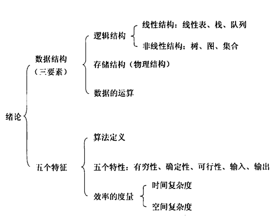
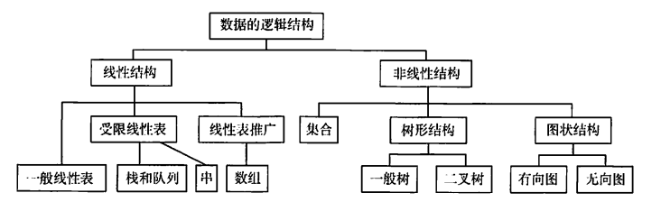
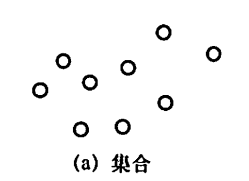
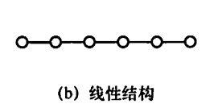
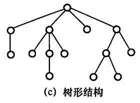
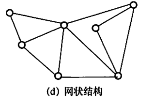

# 论述

知识框架

- **数据结构(三要素)**
    - **逻辑结构**
      - **线性结构**
        - **线型表**
      - **栈**
      - **队列**
  - **储存结构(物理结构)**
  - **数据运算**
- 五个特征
    - 算法定义
  - 五个特性
      - 有穷性
    - 确定性
    - 可行性
    - 输入
    - 输出
  - 效率度量
      - 时间复杂度
    - 空间复杂度

## 1 数据结构的基本概念

### 数据
  
数据是信息的载体, 是客观描述食物属性的数、字符以及所有能输入到计算机中并被计算机程序识别处理的符号的合集。
  
数据是计算机加工的原料。

### 数据元素

数据元素时数据的基本单位，通常作为一个整体进行考虑和处理。

一个数据元素可由若干个数据项组成，数据项是构成数据元素的不可分割的最小单位。

eg：学生记录就是一个数据元素，它由学号、姓名、性别等数据组成；

### 数据对象

数据对象是具有相同性质的数据元素的几个，是数据的一个子集。

eg：整数数据对象集合 N = {0,±1,±2,...};

### 数据类型

数据类型是一个值得集合和定义在此集合上的一组操作的总称。

1. 原子类型
   - 其值不可再分的数据类型
2. 结构类型
   - 其值可以再分解为若干个成分（分量）的数据类型。
3. 抽象数据类型
   - 抽象数据组织与之相关的操作

> 数据结构是ADT的物理实现
> 
> 抽象的意义在于数据类型的数学抽象特性
> 
> ADT使用伪码描述为：
> 
> ADT抽象数据类型名：
> - 数据对象：<数据对象的定义>
> - 数据关系：<数据关系的定义>
> - 基本操作：<基本操作的定义>
> 
> ADT抽象数据类型名
>
> 抽象数据类型的定义有一个值域和定义在该值域上的一组操作组成
> 
> 按照抽象数据类型的值的不同特性，可以分为三种类型：
> 
> - 原子类型：属于原子类型的变量的值是不可再分的
> - 固定聚合类型：属于该类型的变量的值由确定数目的成分按照某种结构组成
> - 可变聚合类型：属于该类型的变量的值的成分数目不确定，其中序列的长度是可变

### 数据结构

数据结构是相互之间存在一种或多种特定关系的数据元素集合。

在任何问题中，数据元素都不是孤立存在，他们之间存在某种关系，这种**数据结构之间的关系称之为结构（Structure）。

数据结构包含三个方面：
  - 逻辑结构
  - 存储结构
  - 数据的运算

数据逻辑结构和存储结构是密不可分的两个方面，一个算法的数据取决于所选定的逻辑结构，而算法的实现依赖于所采用的存储结构。

## 数据结构的三要素

**逻辑结构**
**存储结构**
**数据的运算**

### 1. 逻辑结构

逻辑结构指的是元素之间的逻辑关系，即从逻辑关系上描述数据。

它与数据存储无关，都是独立于计算机的。

数据的逻辑结构分为**线型结构**和**非线性**结构，线性表是典型的线性结构；集合、数和图是典型的非线性结构；

- 线型结构
  - 一般线型表
  - 受限线性表
    - 栈
    - 队列
    - 串
  - 线性表推广
    - 数组
- 非线性结构
  - 集合
  - 树形结构
    - 一般数
    - 二叉树
  - 图状结构
    - 有向图
    - 无向图

#### 集合

结构中**数据元素质检除“同属一个集合”外，别无其他关系**；

#### 线型结构
  
结构中的**数据元素之间只存在一对一的关系**

#### 树形结构

结构中的**数据元素之间存在一对多的关系**

#### 图状结构 （或网状结构）

结构中**数据元素之间存在多对多的关系**

### 2. 存储结构

存储结构是指数据在计算机中的表示也称之为物理结构。

它包括 数据元素的表示 和 关系的表示；

数据存储结构是用计算机语言实现的逻辑结构，他依赖于计算机语言。

数据存储结构主要有：
1. 顺序存储
2. 链式存储
3. 索引存储
4. 散列存储

#### 1. 顺序存储

把逻辑相邻的元素存储在物理相邻的存储单元中，元素之间的关系由存储单元的邻接关系来体现。

其优点是可以实现随机存取，每个元素占用的存储空间最少；

缺点是只能使用相邻的一整块存储单元，因此可能产生较多的外部碎片；

#### 2. 链式存储

不要求逻辑上相邻的元素在物理上也相邻，借助只是元素存储地址的指针来表示元素之间的逻辑关系。

其优点是不会出现碎片，能充分利用存储单元；

缺点是每个元素存储的指针需要占用额外的存储空间，且只能实现顺序存取；

#### 3. 索引存储

在存储元素的信息同时，还建立附加的索引表。

索引表中的每项称之为**索引项**，索引项一般形式是（关键字、地址）。

优点是检索速度快；

缺点是索引会占据额外的空间，删除和增加也需要修改索引比偶，因而恢花费较多的时间；

#### 4. 散列存储

根据元素的关键字直接结算处该元素的存储地址，又称为哈希存储。

有点事检索、增加、删除都很快；

缺点是若散列函数不好，可能出现元素存储冲突，而解决冲突会增加时间和空间的开销；

### 3. 数据的运算

施加在数据上的运算包括运算的定义和实现。

**运算的定义**

是针对逻辑结构哦的，指出运算的功能；

**运算的实现**

是针对存储结构的，指出运算的具体操作步骤；

